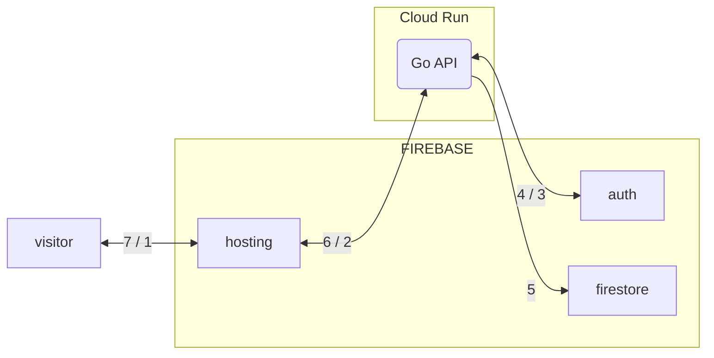
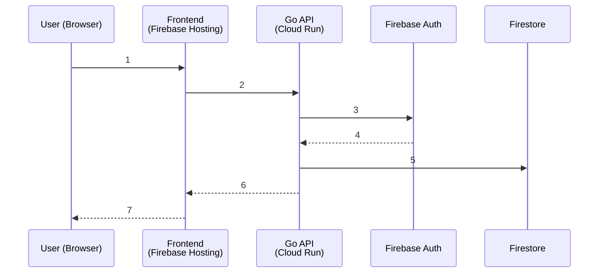
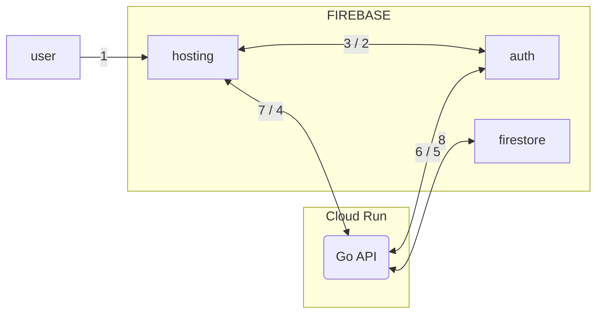
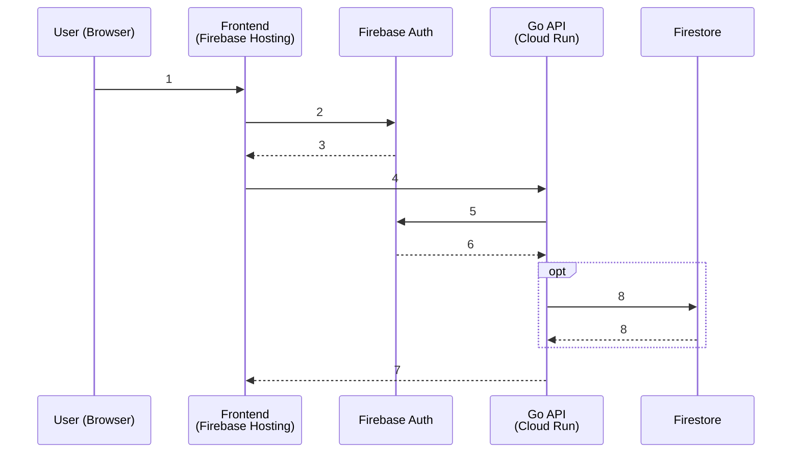

+++
date = '2025-11-28T21:11:22+01:00'
draft = false
title = 'Authentication'
section = 'diagrams'
weight = 530
+++

## Signup workflow

#### Signup workflow

- **1**: User opens app and fills registration form
- **2**: Frontend calls Go API
- **3**: Go API create user in Firebase Auth
- **4**: Auth return UID
- **5**: Go API saves profile in Firestore
- **6**: Go API returns success
- **7**: Frontend shows "registered - now log in"

## Login workflow

Standard hybrid authentication flow where the client uses the Firebase SDK for the primary sign-in and then contacts a custom backend API to establish a persistent session cookie.

- **1**: User opens website and fills email + password
- **2**: Frontend calls Firebase JS SDK → signInWithEmailAndPassword()
- **3**: Firebase Auth returns ID token to browser
- **4**: Frontend calls your Go API with Authorization: Bearer <token>
- **5**: Go API calls authClient.VerifyIDToken()
- **6**: Firebase Auth confirms token is valid → returns UID
- **7**: Go API returns protected data
- **8**: (optional) Go API reads/writes Firestore as admin

