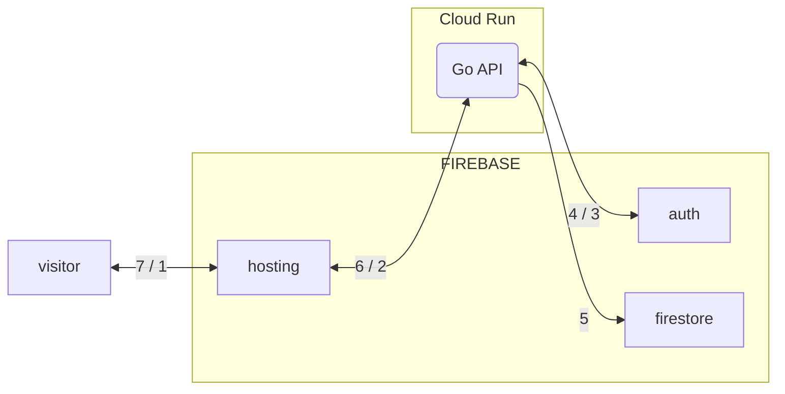
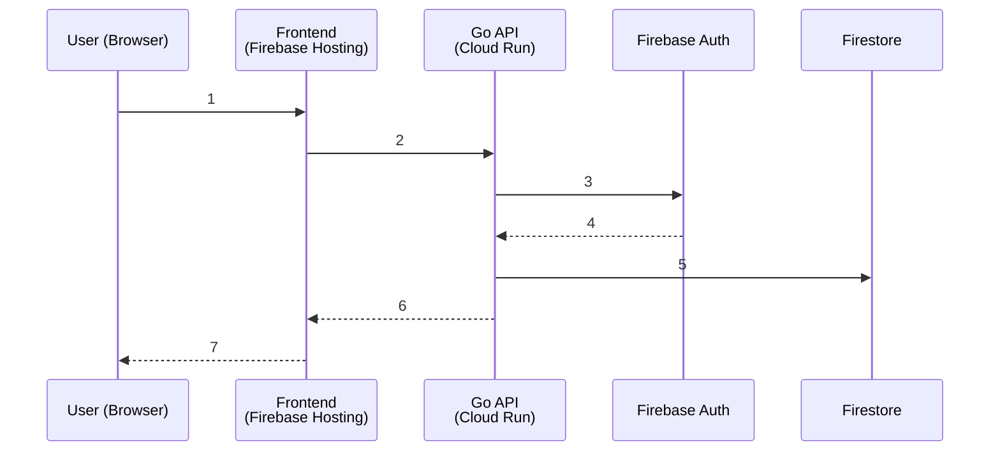
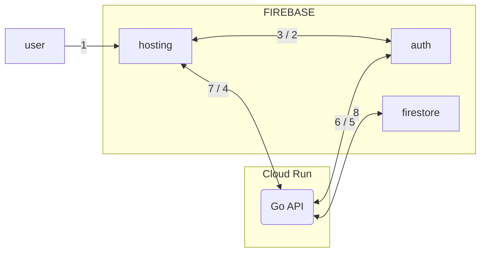
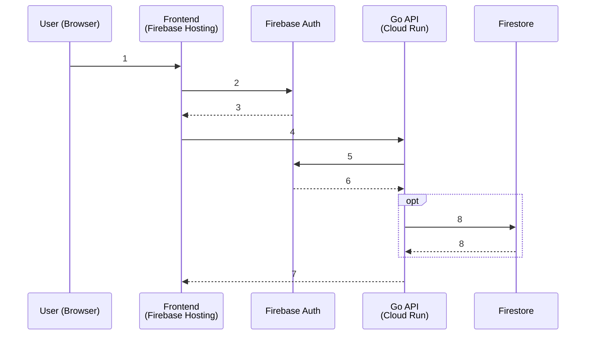

### 1. Firebase Authentication
- Purpose: Manage users and credentials.
- Stores authentication data only:
    - Email / phone number
    - Password hash (not plain text)
    - UID (unique user ID)
    - Provider info (Google, Facebook, etc.)
- Used only for login/signup.
- In your emulator, stored under:
```
.firebase_data/auth_export/accounts.json
```

Does NOT store your app’s additional user info, like profile data, preferences, or posts.

### 2. Firestore (Database)
- Purpose: Store application data, including user-related data.
- Examples of what you might store in Firestore:
    - User profile (display name, avatar, bio)
    - User posts or messages
    - App settings, preferences
    - Any other app data
- Firestore does NOT store passwords; it just stores the UID from Firebase Auth (or email) to associate the data with the user.

### 3. How they work together

Typical flow:

1. User registers with Firebase Auth (email + password).
2. Auth gives a unique UID for that user.
3. Your app writes additional user info to Firestore:

```
users (collection)
 └── UID12345 (document)
      ├── displayName: "Alice"
      ├── bio: "Loves coding"
      └── createdAt: "2025-11-21T12:34:56Z"
```

4. Later, when the user logs in:
    - Firebase Auth verifies their credentials
    - App fetches their profile from Firestore using UID

This separation improves security because passwords never go into the app database.

---

#### Signup workflow



- **1**: User opens app and fills registration form
- **2**: Frontend calls Go API
- **3**: Go API create user in Firebase Auth
- **4**: Auth return UID
- **5**: Go API saves profile in Firestore
- **6**: Go API returns success
- **7**: Frontend shows "registered - now log in"


---

#### Login workflow



- **1**: User opens website and fills email + password
- **2**: Frontend calls Firebase JS SDK → signInWithEmailAndPassword()
- **3**: Firebase Auth returns ID token to browser
- **4**: Frontend calls your Go API with Authorization: Bearer <token>
- **5**: Go API calls authClient.VerifyIDToken()
- **6**: Firebase Auth confirms token is valid → returns UID
- **7**: Go API returns protected data
- **8**: (optional) Go API reads/writes Firestore as admin


---

### 4. In your emulator setup

    - `.firebase_data` → Authentication data (passwords, emails, UIDs)
    - Firestore emulator → Application data (user profiles, app content, settings)

So if you “see user data” in Firestore, that’s the app-specific data, not the passwords.


### How it works step by step

1. User registration (frontend → backend):
    - Frontend sends email/password to your Go API.
    - Go API calls Firebase Auth Emulator to create the user.
    - Firebase Auth Emulator stores the user in .firebase_data/auth_export/accounts.json as hashed password + UID.
2. User profile/data:
    - Backend creates a document in the Firestore emulator under users/<UID> with any extra info (display name, bio, preferences).
    - Firestore does NOT store passwords, only the UID to link the data to the user.
3. User login:
    - Frontend sends credentials to Go backend.
    - Backend verifies via Auth Emulator.
    - Backend fetches the user profile from Firestore using the UID.

### Key takeaways

- Auth Emulator → passwords, UID, login credentials
- Firestore Emulator → app-specific data linked to users
- Separation ensures security: passwords are never in Firestore.
- Your Go backend acts as the bridge between frontend, Auth, and Firestore.

### Go API (`main.go`)

> [!NOTE]
> All the instructions below are aimed for development, not production. The goal is to avoid using real credentials.


  * ✅ **Admin SDK Initialization**: Uses `os.Setenv("FIREBASE_AUTH_EMULATOR_HOST", authHost)` to correctly point the Admin SDK to the emulator.
  * ✅ **Register**: `registerHandler` now calls `authClient.CreateUser` (Admin SDK) to create the user in the Firebase Auth Emulator.
  * ✅ **Token Verification**: Added `authMiddleware` using `authClient.VerifyIDToken` to secure a new `protectedHandler`.
  * ❌ **Login**: `loginHandler` is not necessary, as the client is responsible for this step.
  * ❌ **Logout**: `logoutHandler` is not necessary, as the client is responsible for this step.

During development cycle, when the Admin SDK sees the `FIREBASE_AUTH_EMULATOR_HOST` environment variable, it is designed to automatically bypass the need for a service account and switch to the local, insecure connection. We set and environmental variable in the development version of podman compose file.

Furthermore, the most stable, community-verified solution that bypasses both the credential check (needed for Auth) and the conflicting transport check (needed for Firestore) is to use a specific combination of options:

- `option.WithoutAuthentication()`: This is the official way to tell the SDK not to look for production credentials, allowing it to rely on the emulator host environment variables.
- `option.WithGRPCConnectionPool(1)`: This option is often required to stabilize the gRPC client’s initialization, which is what Firestore uses, thereby preventing the *WithHTTPClient is incompatible with WithGRPCConn* error that results from the SDK trying to enforce strict client types.


### - `main.go`

The Firebase Authenticator implementation in code lives on `backend/main.go`

> [!WARNING]
> It's **PARAMOUNT** to import the latest version of `firebase.google.com/go` and `firebase.google/com/go/firebase`.

This is the code needed to run:

```
// ...
import (
    // ...
    "google.golang.org/api/option"
    "cloud.google.com/go/firestore"
    firebase "firebase.google.com/go/v4"
	"firebase.google.com/go/v4/auth"
)

func main() {
	ctx := context.Background()

	authHost := os.Getenv("FIREBASE_AUTH_EMULATOR_HOST")
	if authHost == "" {
		log.Fatal("FIREBASE_AUTH_EMULATOR_HOST environment variable not set.")
	}
	log.Printf("Using Firebase Auth Emulator Host: %s\n", authHost)

	firestoreHost := os.Getenv("FIRESTORE_EMULATOR_HOST")
	if firestoreHost == "" {
		log.Fatal("FIRESTORE_EMULATOR_HOST environment variable not set.")
	}
	log.Printf("Using Firestore Emulator Host: %s\n", firestoreHost)

	conf := &firebase.Config{ProjectID: "my-test-project"}

	app, err := firebase.NewApp(ctx, conf,
		option.WithoutAuthentication(),
		option.WithGRPCConnectionPool(1),
	)
// ...
```

### - `go.mod`

You must have the following go.mod file. Note that `firebase.google.com` version must be 4 or bigger, otherwise 

```
module go-api-backend

go 1.25.4

require (
	cloud.google.com/go/firestore v1.20.0
	firebase.google.com/go/v4 v4.18.0
	google.golang.org/api v0.256.0
)
```

### - `firebase/firestore.rules`

Also, during development, we must allow read/write on the emulator:

```
rules_version = '2';
service cloud.firestore {
  match /databases/{database}/documents {
    match /{document=**} {
      allow read, write: if true;
    }
  }
}
```

### - `firebase/firebase.json`

```
{
  "hosting": {
    "public": "../public",
    "host": "0.0.0.0"
  },
  "firestore": {
    "rules": "firestore.rules",
    "indexes": "firestore.indexes.json",
    "host": "0.0.0.0"
  },
  "emulators": {
    "hosting": { "port": 5000, "host": "0.0.0.0" },
    "firestore": { "port": 8080, "host": "0.0.0.0" },
    "auth": { "port": 9099, "host": "0.0.0.0" },
    "ui": { "enabled": true, "port": 4000, "host": "0.0.0.0" }
  }
}
```

### - `compose.dev.yaml`

```
/...

  # -----------------------------------------------------
  # NEW SERVICE: Go API Backend
  # -----------------------------------------------------
  go-backend:
    image: localhost/test_go-backend:latest
    build:
      context: ./backend
      dockerfile: Containerfile
    container_name: go-api-backend
    ports:
      - "8081:8081" # Expose the API port
    # Ensure it starts after the firebase emulator is up (optional but good practice)
    depends_on:
      - firebase
    environment:
      # Pass the internal network address of the emulator (service name) to the API
      - FIRESTORE_EMULATOR_HOST=firebase:8080
      - FIREBASE_AUTH_EMULATOR_HOST=firebase:9099
    security_opt:
      - label=disable # Required for Fedora/RedHat/SELinux!
```
