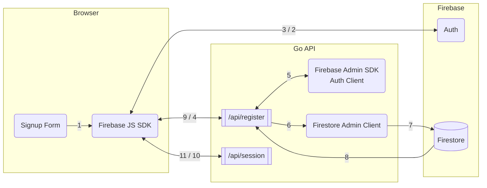
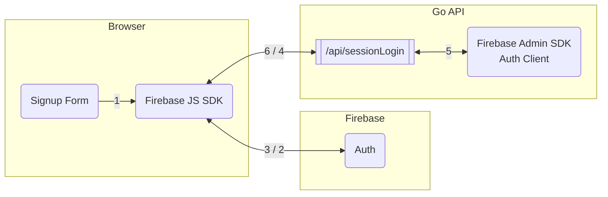
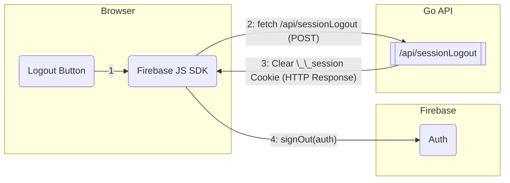

Authentication is the process of securely and effectively managing signups, logins, logouts and credentials storage.

The current architecture implements a **Session Cookie-based authentication flow** that uses both the Firebase Client SDK (in the browser) and the Firebase Admin SDK (in your Go backend) for registration, login and logout. Firestore Admin Client (in your Go backend) is used for credential storage.

* * *

## Authentication Process Summary

The system uses the short-lived Firebase ID Token as a **one-time exchange credential** to establish a **long-lived, secure, HTTP-only session cookie** controlled by the Go API.

### 1\. Register Process

**(Client-Side Auth + Backend Profile Creation)**

The registration is a two-step process: account creation via the client, followed by profile storage and session creation via the backend.

-   **1\. Client Authentication:** The user submits the registration form. The client-side Firebase JS SDK calls `createUserWithEmailAndPassword` to create the user account in the Firebase Auth Emulator. A short-lived **ID Token** is returned.
-   **2\. Backend Profile & Plan Storage:** The client makes the first call to your Go API endpoint, `/api/register`, sending the ID Token, name, and desired plan.
    -   The Go API uses the Admin SDK’s `VerifyIDToken` to authenticate the request.
    -   It then uses the Firestore Client to save the user’s custom profile data (plan, name, email) into the `users` collection.
-   **3\. Session Establishment:** The client immediately makes the second call to `/api/sessionLogin` with the same ID Token.
    -   The Go API validates the token and generates a long-lived, secure `__session` **cookie** using `authClient.SessionCookie()`, setting it on the user’s browser.
-   **Final State:** The user is created, their profile is saved, and a secure session is established.

* * *

### 2\. Login Process

**(Client-Side Auth + Backend Session Cookie Exchange)**

Login is a dedicated process to establish the long-lived session after successful credential verification.

-   **1\. Client Authentication:** The user submits the login form. The client-side Firebase JS SDK calls `signInWithEmailAndPassword`, verifying credentials with the Auth Emulator. A short-lived **ID Token** is returned.
-   **2\. Backend Session Exchange:** The client sends the ID Token to your Go API endpoint, `/api/sessionLogin`.
    -   The Go API verifies the token’s validity.
    -   The Go API generates a **long-lived session cookie** (`__session`) using `authClient.SessionCookie()` and sends it back in the HTTP response header.
-   **Final State:** The user is logged in, and the secure, HTTP-only `__session` cookie is present on the client’s browser for all subsequent authenticated requests.

* * *

### 3\. Logout Process

**(Hybrid Session Clearing)**

Logout requires a coordinated effort between the client and the server to ensure both the client’s local state and the server’s session cookie are cleared.

-   **1\. Backend Session Clearing:** The user clicks the Logout button. The client-side JavaScript first calls the Go API endpoint `/api/sessionLogout`.
    -   The Go handler `handleSessionLogout` receives the request and **clears the secure `__session` cookie** by setting its `MaxAge` to `-1`. This is necessary because JavaScript cannot delete an `HttpOnly` cookie.
-   **2\. Client-Side Clearing:** After the backend call completes, the client-side JavaScript calls `signOut(auth)` from the Firebase SDK. This clears any local Firebase authentication state.
-   **Final State:** The session cookie is deleted from the browser, the client’s local auth state is cleared, and the user is redirected to the home page (`/`).

* * *

## Motivations

The application uses **Firebase Session Cookies** for long-term, secure access to the Go backend and content.

The Go API is necessary because it performs two critical security operations that client-side JavaScript **cannot** perform: **session cookie creation** and **session cookie deletion**.

### 1\. Secure Login (`/api/sessionLogin`)

The client-side Firebase SDK only gives you a **short-lived JWT ID Token**. Your Go backend must be involved to secure the session.

-   **Cookie Security:** The Go API is responsible for exchanging the ID Token for a **long-lived, HTTP-only session cookie**. This `HttpOnly` flag prevents client-side JavaScript from accessing the cookie, which significantly mitigates Cross-Site Scripting (XSS) attacks where malicious scripts could steal the session token.
-   **Server-Side State:** The cookie is set on the server via the HTTP response, and all subsequent requests to protected routes rely on the Go API verifying this cookie using the Admin SDK.

### 2\. Secure Logout (`/api/sessionLogout`)

To fully terminate the secure, long-lived session, the server must be involved.

-   **HTTP-Only Constraint:** Since the session cookie is `HttpOnly`, client-side JavaScript **cannot delete it**.
-   **Server Action:** The only way to securely clear this cookie is for the client to request the Go API endpoint `/api/sessionLogout`. The Go handler `handleSessionLogout` then clears the cookie by setting its `MaxAge` to a negative value in the response, effectively instructing the browser to delete it.

### The Alternative (Without Go API)

If Go API is not used for session management, you would rely purely on the short-lived Firebase ID Tokens handled by the client (which auto-refreshes). This is possible, but it means:

1.  Your Go backend would need to **verify the ID Token on every single request** (which is computationally expensive).
2.  You would need to pass this token in the `Authorization` header on every request, which is often less seamless than relying on a standard session cookie.

By implementing the session cookie flow, you are prioritizing **server-side control** and **cookie security**, which necessitates the Go API handlers.

* * *

## Responsabilities

### 1\. Firebase Authentication

-   Purpose: Manage users and credentials.
-   Generates ID token
-   Stores authentication data only:
    -   Email / phone number
    -   Password hash (not plain text)
    -   UID (unique user ID)
    -   Provider info (Google, Facebook, etc.)
-   Used only for login/signup.
-   In your emulator, stored under:

```
.firebase_data/auth_export/accounts.json
```

Firebase Authentication does NOT store your app’s additional user info, like profile data, preferences, or posts.

### 2\. Cloud Run (Go API)

-   Purpose: Creates user session
-   Receives ID token from Firebase Authenticaton
-   Creates Session cookie
-   Enables backend-authenticated pages (content guard)
-   Controls Hugo menu state
-   Makes user a “member”

### 3\. Firestore (Database)

-   Purpose: Store application data, including user-related data.
-   Examples of what you might store in Firestore:
    -   User profile (display name, avatar, bio)
    -   User posts or messages
    -   App settings, preferences
    -   Any other app data
-   Firestore does NOT store passwords; it just stores the UID from Firebase Auth (or email) to associate the data with the user.

### How they work together

Typical flow:

1.  User registers with Firebase Auth (email + password).
2.  Auth gives a unique UID for that user.
3.  Your app (Go API backend) writes additional user info to Firestore:

```
users (collection)
 └── UID12345 (document)
      ├── name: "alice"
      ├── email: "alice@mail.com"
      ├── plan: "elite"
      └── createdAt: "2025-11-21T12:34:56Z"
```

5.  Later, when the user logs in:
    -   Firebase Auth verifies their credentials
    -   Firebase Auth sends ID token to Cloud Run
    -   Cloud Run receives ID token and creates session cookie
    -   App fetches their profile from Firestore using UID

This separation improves security because passwords never go into the app database.

* * *

## Processes, Workflows, Sequences

### 1\. Signup

Files involved:

-   `backend/main.go`
-   `frontend/layouts/account/register.html`




-   **1**: The user submits the form. The Firebase JS SDK (running in the browser) intercepts the event after the password check passes (6 character minimum).
-   **2**: The client calls the Firebase function `createUserWithEmailAndPassword`, sending the email/password to the Auth Emulator to create the user account.
-   **3**: Firebase Auth successfully creates the user and returns the short-lived ID Token to the client.
-   **4**: The client makes the first POST call to `/api/register`, sending the ID Token along with user data (name, plan) to the backend for application-specific registration.
-   **5**: The Go API uses the Admin SDK Auth Client to call `VerifyIDToken`, confirming the token’s validity and obtaining the user’s `UID`.
-   **6/7**: The Go API uses the Firestore Admin Client to execute a `Set()` operation, saving the user’s Name, Email, and Plan into the `users` collection in Firestore.
-   **8/9**: The backend sends a success response, and the client proceeds to the session login request.
-   **10**: The client makes the second POST call to `/api/sessionLogin`, sending the ID Token to request a persistent session.
-   **11**: The backend generates a Session Cookie and sets it on the client’s browser via the HTTP response header.


* * *

### 2\. Login

Standard hybrid login authentication flow where the client uses the Firebase SDK for the primary sign-in and then contacts a custom backend API to establish a persistent session cookie.

Files involved:

-   `backend/main.go`
-   `frontend/layouts/account/login.html`



-   **1.** The user submits the login form containing the email and password. The client-side Firebase JS SDK intercepts the submit event.
-   **2.** The client-side Firebase JS SDK calls `signInWithEmailAndPassword`, sending the credentials to the Auth Emulator for verification.
-   **3.** If successful, the Auth Emulator returns the User Credential object, which includes a newly generated, short-lived ID Token.
-   **4.** The client makes a POST request to the custom backend endpoint, `/api/sessionLogin`, sending the ID Token to initiate a secure session.
-   **5.** The Go API uses the Admin SDK Auth Client to call `VerifyIDToken` to confirm the token’s validity and get the user’s `UID`.
-   **6.** The backend verifies the ID Token and generates a long-lived Session Cookie using `authClient.SessionCookie()`, and sets it on the client’s browser via the HTTP response header.


* * *

### 3\. Logout

Files involved:

-   `backend/main.go`
-   `frontend/layouts/baseof.html`



-   **1.** The user clicks the Logout button, which has the ID logout-button (defined in hugo.toml). The event listener in baseof.html intercepts this click.
-   **2.** The client side Firebase JS SDK calls the custom Go API endpoint `/api/sessionLogout` using a POST request. This request is designed to include the session cookie (credentials: “include”).
-   **3.** The Go handler function, `handleSessionLogout` receives the request and immediately clears the secure, long-lived `__session` cookie by setting its `MaxAge` to -1 in the HTTP response header. This effectively logs the user out from the server-side session.
-   **4.** After the backend call completes, the client-side JavaScript calls `signOut(auth)` from the Firebase JS SDK. This clears the short-lived, client-side Firebase authentication state (local tokens, etc.).

### In your emulator setup

> [!TIP]
> `.firebase_data/` → Authentication data (passwords, emails, UIDs)
>
> Firestore emulator → Application data (user profiles, app content, settings)


So if you “see user data” in Firestore, that’s the app-specific data, not the passwords.

### Key takeaways

-   Auth Emulator → passwords, UID, login credentials
-   Firestore Emulator → app-specific data linked to users (profile, account, dashboard)
-   Separation ensures security: passwords are never in Firestore.
-   Your Go backend acts as the bridge between frontend, Auth, and Firestore.

## Code

### \- `main.go`

The Firebase Authenticator implementation in code lives on `backend/main.go`

> [!WARNING]
> It’s **PARAMOUNT** to import the latest version of `firebase.google.com/go` and `firebase.google/com/go/firebase`.

This is the code needed to run:

```go
package main

import (
	"context"
	"encoding/json"
	"log"
	"net/http"
	"os"
	"time"

	"cloud.google.com/go/firestore"
	firebase "firebase.google.com/go/v4"
	"firebase.google.com/go/v4/auth"
)

var (
	// Use environment variables or fall back to local dev paths
	StaticRoot  = getEnv("STATIC_ROOT", "public")
	ContentRoot = getEnv("CONTENT_ROOT", "../frontend/content/posts")
)

type UserRegistration struct {
	IDToken string `json:"idToken"`
	Name    string `json:"name"`
	Email   string `json:"email"`
	Plan    string `json:"plan"`
}

// AuthUser holds the necessary information after a successful session check
type AuthUser struct {
	UID          string
	Email        string
	Plan         string // Fetched from Firestore
	Name         string
	RegisteredAt time.Time
}

var authClient *auth.Client
var firestoreClient *firestore.Client

// getEnv reads an environment variable or returns a fallback
func getEnv(key, fallback string) string {
	if value, ok := os.LookupEnv(key); ok {
		return value
	}
	return fallback
}

// --- Server & Handlers ---

type Server struct {
	hugoFS http.Handler
}

func NewServer() *Server {
	return &Server{
		hugoFS: http.FileServer(http.Dir(StaticRoot)),
	}
}

// --- Handlers (API) ---

// handleRegister handles the second stage of registration: verifying the user and
// storing their profile in Firestore.
func handleRegister(w http.ResponseWriter, r *http.Request) {
	if r.Method != http.MethodPost {
		http.Error(w, "Method not allowed", http.StatusMethodNotAllowed)
		return
	}

	var userReg UserRegistration
	if err := json.NewDecoder(r.Body).Decode(&userReg); err != nil {
		http.Error(w, "Invalid request body", http.StatusBadRequest)
		return
	}

	// 1. Verify the ID Token to get the user's UID
	token, err := authClient.VerifyIDToken(r.Context(), userReg.IDToken)
	if err != nil {
		log.Printf("ID Token verification failed: %v", err)
		// Return 401 Unauthorized if the token is invalid
		http.Error(w, "Invalid ID Token: "+err.Error(), http.StatusUnauthorized)
		return
	}

	userUID := token.UID

	// 2. Store user plan and name in Firestore
	userProfile := map[string]any{
		"plan":         userReg.Plan,
		"name":         userReg.Name,
		"email":        userReg.Email,
		"registeredAt": firestore.ServerTimestamp,
	}

	_, err = firestoreClient.Collection("users").Doc(userUID).Set(r.Context(), userProfile)
	if err != nil {
		// Log the error and return a 500 error, as Firestore is critical for the plan
		log.Printf("Firestore set user profile failed for UID %s: %v", userUID, err)
		http.Error(w, "Registration failed: Could not save user plan.", http.StatusInternalServerError)
		return
	}

	w.WriteHeader(http.StatusOK) // Use 200 OK for a successful profile update
	json.NewEncoder(w).Encode(map[string]string{"uid": userUID, "message": "User profile saved successfully"})
}

// handleSessionLogin exchanges the Firebase ID Token for a secure session cookie.
func handleSessionLogin(w http.ResponseWriter, r *http.Request) {
	if r.Method != http.MethodPost {
		http.Error(w, "Method not allowed", http.StatusMethodNotAllowed)
		return
	}

	var req struct {
		IDToken string `json:"idToken"`
	}
	if err := json.NewDecoder(r.Body).Decode(&req); err != nil {
		http.Error(w, "Invalid request body", http.StatusBadRequest)
		return
	}

	// Set session expiration to 5 days
	expiresIn := time.Hour * 24 * 5

	// Create the session cookie
	cookie, err := authClient.SessionCookie(r.Context(), req.IDToken, expiresIn)
	if err != nil {
		log.Printf("Failed to create session cookie: %v", err)
		http.Error(w, "Failed to create session cookie", http.StatusInternalServerError)
		return
	}

	// Set the session cookie on the client
	http.SetCookie(w, &http.Cookie{
		Name:     "__session",
		Value:    cookie,
		MaxAge:   int(expiresIn.Seconds()),
		HttpOnly: true,
		Secure:   false, // Set to true in production with HTTPS
		SameSite: http.SameSiteLaxMode,
		Path:     "/",
	})

	w.WriteHeader(http.StatusOK)
	json.NewEncoder(w).Encode(map[string]string{"message": "Session cookie set successfully"})
}

// handleSessionLogout clears the session cookie.
func handleSessionLogout(w http.ResponseWriter, r *http.Request) {
	// Clear the session cookie by setting MaxAge to a negative value
	http.SetCookie(w, &http.Cookie{
		Name:     "__session",
		Value:    "",
		MaxAge:   -1,
		HttpOnly: true,
		Secure:   false, // Set to true in production with HTTPS
		SameSite: http.SameSiteLaxMode,
		Path:     "/",
	})
	w.WriteHeader(http.StatusOK)
	json.NewEncoder(w).Encode(map[string]string{"message": "Logged out successfully"})
}

// handleSession checks if a user is logged in via the session cookie and returns their full profile.
func handleSession(w http.ResponseWriter, r *http.Request) {
	user := getAuthenticatedUserFromCookie(r)

	if user != nil {
		registeredAtStr := ""
		if !user.RegisteredAt.IsZero() {
			// Format the time as a simple date string, e.g., "Jan 2, 2006"
			registeredAtStr = user.RegisteredAt.Format("Jan 2, 2006")
		}

		w.WriteHeader(http.StatusOK)
		json.NewEncoder(w).Encode(map[string]any{
			"loggedIn":     true,
			"plan":         user.Plan,
			"email":        user.Email,
			"name":         user.Name,       // Added for dashboard
			"registeredAt": registeredAtStr, // Added for dashboard
		})
		return
	}

	w.WriteHeader(http.StatusOK)
	json.NewEncoder(w).Encode(map[string]any{
		"loggedIn": false,
		"plan":     "visitor",
	})
}

// getAuthenticatedUserFromCookie verifies the Firebase Session Cookie and fetches the user's plan.
// Note: This relies on the client successfully exchanging the ID Token for a Session Cookie
// and sending that cookie back with subsequent requests.
// getAuthenticatedUserFromCookie verifies the Firebase Session Cookie and fetches the user's plan.
func getAuthenticatedUserFromCookie(r *http.Request) *AuthUser {
	// 1. Read the Firebase Session Cookie
	cookie, err := r.Cookie("__session")
	if err != nil {
		return nil // No cookie found, user is unauthenticated
	}

	// 2. Verify the Session Cookie
	token, err := authClient.VerifySessionCookie(r.Context(), cookie.Value)
	if err != nil {
		log.Printf("Session cookie verification failed: %v", err)
		return nil
	}

	// 3. Extract Email from token claims (Definition of userEmail)
	userEmail, ok := token.Claims["email"].(string)
	if !ok {
		log.Printf("Warning: Email claim missing from Firebase token for UID: %s", token.UID)
		userEmail = ""
	}

	// 4. Fetch custom plan data from Firestore
	userPlan := "basic" // Definition of userPlan
	userName := ""
	var registeredAt time.Time // Initialize registration time to Zero value

	// firestoreClient must be initialized in main()
	if firestoreClient != nil {
		dsnap, err := firestoreClient.Collection("users").Doc(token.UID).Get(r.Context())
		if err == nil && dsnap.Exists() {
			data := dsnap.Data()
			if p, found := data["plan"].(string); found {
				userPlan = p
			}
			if n, found := data["name"].(string); found {
				userName = n // RETRIEVE NAME
			}
			// Firestore's ServerTimestamp maps to time.Time in Go
			if ts, found := data["registeredAt"].(time.Time); found {
				registeredAt = ts // RETRIEVE TIMESTAMP
			}
		} else if err != nil {
			log.Printf("Warning: Failed to fetch user profile for %s from Firestore: %v", token.UID, err)
		}
	}

	// 5. Return the full AuthUser profile
	return &AuthUser{
		UID:          token.UID,
		Email:        userEmail,
		Plan:         userPlan,
		Name:         userName,
		RegisteredAt: registeredAt,
	}
}

// --- Main Function ---

func main() {
	// Initialize Firebase Admin SDK
	ctx := context.Background()
	app, err := firebase.NewApp(ctx, &firebase.Config{
		ProjectID: "my-test-project",
	})
	if err != nil {
		log.Fatalf("error initializing firebase app: %v", err)
	}

	// Initialize Firebase Auth Client
	authClient, err = app.Auth(ctx)
	if err != nil {
		log.Fatalf("error getting auth client: %v", err)
	}

	// Initialize Firestore Client
	firestoreClient, err = app.Firestore(ctx)
	if err != nil {
		log.Fatalf("error getting firestore client: %v", err)
	}

	// API Handlers (Existing)
	http.HandleFunc("/api/register", handleRegister)
	http.HandleFunc("/api/sessionLogin", handleSessionLogin)
	http.HandleFunc("/api/sessionLogout", handleSessionLogout)
	http.HandleFunc("/api/session", handleSession)

	// Start Server
	port := getEnv("PORT", "8081")
	log.Printf("Starting Go server on :%s", port)
	if err := http.ListenAndServe(":"+port, nil); err != nil {
		log.Fatalf("Server failed to start: %v", err)
	}
}
```

### \- `go.mod`

```
You must have the following go.mod file. Note that `firebase.google.com` version must be 4 or bigger, otherwise

```
module go-api-backend

go 1.25.4

require (
    cloud.google.com/go/firestore v1.20.0
    firebase.google.com/go/v4 v4.18.0
)

```
```

### - `firestore.rules`

Also, during development, we must allow read/write on the emulator:
```

rules\_version = ‘2’; service cloud.firestore { match /databases/{database}/documents { match /{document=\*\*} { allow read, write: if true; } } }

```

### - `firebase.json`

```yaml
{
  "hosting": {
    "public": "public",
    "ignore": [
      "firebase.json",
      "**/.*",
      "**/node_modules/**"
    ],
    "rewrites": [
      {
        "source": "/api/**",
        "destination": "http://backend:8081/api/**"
      },
      {
        "source": "**",
        "destination": "/index.html"
      }
    ]
  },
  "firestore": {
    "rules": "firestore.rules",
    "indexes": "firestore.indexes.json"
  },
  "emulators": {
    "auth": { "port": 9099, "host": "0.0.0.0" },
    "firestore": { "port": 8080, "host": "0.0.0.0" },
    "hosting": { "enabled": false },
    "ui": { "enabled": true, "port": 4000, "host": "0.0.0.0" },
    "singleProjectMode": true
  }
}
```

### \- `compose.dev.yaml`

```
/...

  # ----------------------------------------------------------------
  # 2. Go Backend Service
  # ----------------------------------------------------------------
  backend:
    build:
      context: ./backend
      dockerfile: Containerfile
    container_name: go-backend
    image: localhost/go-api:latest
    ports:
      - "8081:8081"
    environment:
      - PORT=8081
      - STATIC_ROOT=/public
      - CONTENT_ROOT=/app/posts
      - FIRESTORE_EMULATOR_HOST=firebase:8080
      - FIREBASE_AUTH_EMULATOR_HOST=firebase:9099
      - PROJECT_ID=my-test-project
      - GCLOUD_PROJECT=my-test-project
      - GOOGLE_CLOUD_PROJECT=my-test-project
    volumes:
      - ${PWD}/frontend/public:/public:ro
      - ${PWD}/frontend/content/posts:/app/posts:ro
    depends_on:
      - firebase
    networks:
      - custom_app_network
    network_aliases:
      - go-api-service
    command: ["/app/go-server", "--http=0.0.0.0:8081"]
```

### \- `register.html`

Here’s a **complete, production-ready registration (sign-up) page** that works perfectly with:

-   Firebase Authentication (email + password)
-   Your future Go backend on Cloud Run (`/api/**`)
-   Hugo templates
-   Local development on **localhost:5000** (Firebase emulator)

`frontend/layouts/account/register.html`

```html
{{ define "main" }}
<section class="register-section">
  <h1 class="tc mb3">{{ .Title }}</h1>

  <!-- Custom Message Box for Passwords -->
  <div id="password-error-message" class="bg-light-red white pa2 br2 mb3 dn">
    Passwords do not match. Please try again.
  </div>

  <form id="register-form" class="register-form">
    <div class="form-group">
      <label for="name">Full Name</label>
      <input
        id="name"
        name="name"
        type="text"
        placeholder="John Doe"
        required
      />
    </div>

    <div class="form-group">
      <label for="email">Email</label>
      <input
        id="email"
        type="email"
        name="email"
        placeholder="you@example.com"
        required
      />
    </div>

    <div class="form-group">
      <label for="password">Password</label>
      <input
        id="password"
        type="password"
        name="password"
        placeholder="********"
        required
      />
    </div>

    <div class="form-group">
      <label for="confirm-password">Confirm Password</label>
      <input
        id="confirm-password"
        type="password"
        name="confirm-password"
        placeholder="********"
        required
      />
    </div>

    <div class="form-group">
      <label for="subscription">Choose Subscription</label>
      <select name="plan" id="subscription">
        <option value="basic">Basic - $9/mo</option>
        <option value="pro">Pro - $19/mo</option>
        <option value="elite">Elite - $49/mo</option>
      </select>
    </div>

    <button type="submit" class="grow bg-blue b white pa3 br2 bn pointer w-100">
      Register
    </button>
    <p id="registerMessage" style="color: green"></p>
  </form>
  <p class="mt2 login-cta">
    Already have an account?
    <a href="/login" class="login-link">Login here</a>
  </p>
</section>


<script type="module">
  // --- REAL Firebase SDK Imports ---
  import { initializeApp } from "https://www.gstatic.com/firebasejs/9.6.1/firebase-app.js";
  import { updateNavVisibility } from "/js/auth.js"; // Adjust path if necessary
  import {
    getAuth,
    connectAuthEmulator,
    // CRITICAL: Use the function for creating a new user
    createUserWithEmailAndPassword,
  } from "https://www.gstatic.com/firebasejs/9.6.1/firebase-auth.js";

  // NOTE: Config must match your Firebase project setup (usually found in auth_init.html)
  const firebaseConfig = {
    apiKey: "AIzaSy...",
    authDomain: "my-test-project.firebaseapp.com",
    projectId: "my-test-project",
  };

  // Initialize app and auth
  const app = initializeApp(firebaseConfig);
  const auth = getAuth(app);

  // CRITICAL: Point the client SDK to the Auth Emulator (http://localhost:9099)
  connectAuthEmulator(auth, "http://localhost:9099");

  // Get elements and set up event listener
  document
    .getElementById("register-form")
    .addEventListener("submit", async (e) => {
      e.preventDefault();

      const email = document.getElementById("email").value;
      const password = document.getElementById("password").value;
      const confirmPassword = document.getElementById("confirm-password").value;
      const name = document.getElementById("name").value;
      const plan = document.getElementById("subscription").value;
      const messageElement = document.getElementById("registerMessage");
      const passwordErrorElement = document.getElementById("password-error-message");

      if (password !== confirmPassword) {
        passwordErrorElement.style.display = "block";
        return;
      }
      passwordErrorElement.style.display = "none";

      messageElement.textContent = "Registering user via Firebase SDK...";

      try {
        // 1. CLIENT-SIDE SDK: Create a new user with the Auth Emulator
        const userCredential = await createUserWithEmailAndPassword( // <-- FIXED LINE
          auth,
          email,
          password,
        );
        const idToken = await userCredential.user.getIdToken();

        // 2. BACKEND API: Send the ID Token to the Go server for full registration
        const registerRes = await fetch("/api/register", {
          method: "POST",
          credentials: "include",
          headers: { "Content-Type": "application/json" },
          body: JSON.stringify({
            idToken,
            plan,
            name,
            email,
          }),
        });

        // Handle backend registration failure
        if (!registerRes.ok) {
            throw new Error(`Backend registration failed with status ${registerRes.status}`);
        }

        // 3. EXCHANGE ID TOKEN FOR BACKEND SESSION COOKIE
        await fetch("/api/sessionLogin", {
          method: "POST",
          credentials: "include",
          headers: { "Content-Type": "application/json" },
          body: JSON.stringify({ idToken }),
        });

        messageElement.textContent = `Success! Welcome, ${userCredential.user.email}. Redirecting to dashboard...`;

        // Redirect to the dashboard
        setTimeout(() => {
          window.location.href = "/dashboard";
        }, 1000);
      } catch (error) {
        // Error handling now catches failed registration issues
        messageElement.textContent = `Registration failed: ${error.message}`;
        messageElement.style.color = "red";
        console.error(error);
      }
    });

  // Select plan from URL
  document.addEventListener("DOMContentLoaded", () => {
    const urlParams = new URLSearchParams(window.location.search);
    const plan = urlParams.get("plan");
    const select = document.getElementById("subscription");

    if (plan && select) {
      select.value = plan;
    } else if (select) {
      select.value = "pro";
    }
    // Update navigation visibility after DOM is loaded
    updateNavVisibility();
  });
</script>
{{ end }}
```

### \- `login.html`

Standard hybrid login authentication flow where the client uses the Firebase SDK for the primary sign-in and then contacts a custom backend API to establish a persistent session cookie.

```html
{{ define "main" }}
<section class="login-section">
  <h1 class="tc mb3">{{ .Title }}</h1>

  <form id="login-form" class="login-form">
    <div class="form-group">
      <label for="email">Email</label>
      <input
        type="email"
        id="email"
        name="email"
        placeholder="you@example.com"
        required
      />
    </div>

    <div class="form-group">
      <label for="password">Password</label>
      <input
        type="password"
        id="password"
        name="password"
        placeholder="••••••••"
        required
      />
    </div>

    <button type="submit" class="grow bg-blue b white pa3 br2 bn pointer w-100">
      Login
    </button>
    <p id="loginMessage" style="color: green"></p>
  </form>
  <!-- CTA for users who haven't registered -->
  <p class="mt2 register-cta">
    Don’t have an account?
    <a href="/register" class="register-link">Register here</a>
  </p>
</section>

<script type="module">
  // --- REAL Firebase SDK Imports ---
  // Using CDN links to load the real Firebase modules (must be accessible by the browser)
  import { initializeApp } from "https://www.gstatic.com/firebasejs/9.6.1/firebase-app.js";
  import { updateNavVisibility } from "/js/auth.js";
  import {
    getAuth,
    signInWithEmailAndPassword,
    connectAuthEmulator,
  } from "https://www.gstatic.com/firebasejs/9.6.1/firebase-auth.js";

  // NOTE: Config is for the SDK structure.
  const firebaseConfig = {
    apiKey: "AIzaSy...",
    authDomain: "my-test-project.firebaseapp.com",
    projectId: "my-test-project",
  };

  // Initialize app and auth
  const app = initializeApp(firebaseConfig);
  const auth = getAuth(app);

  // CRITICAL FIX: Point the client SDK to the Auth Emulator running on localhost:9099
  connectAuthEmulator(auth, "http://localhost:9099");

  document.addEventListener("DOMContentLoaded", async () => {
    updateNavVisibility();
  });

  document
    .getElementById("login-form")
    .addEventListener("submit", async (e) => {
      e.preventDefault();

      const email = document.getElementById("email").value;
      const password = document.getElementById("password").value;
      const messageElement = document.getElementById("loginMessage");
      messageElement.textContent = "Signing in via Firebase SDK...";

      try {
        // 1. CLIENT-SIDE SDK: Sign in directly with the Auth Emulator
        const userCredential = await signInWithEmailAndPassword(
          auth,
          email,
          password,
        );
        const idToken = await userCredential.user.getIdToken();

        // 2. Store the token for future API calls
        localStorage.setItem("id_token", idToken);

        // --- NEW CRITICAL STEP: Exchange ID Token for Session Cookie ---
        messageElement.textContent = "Exchanging token for secure session...";
        await fetch("/api/sessionLogin", {
          method: "POST",
          credentials: "include",
          headers: { "Content-Type": "application/json" },
          body: JSON.stringify({ idToken }),
        });

        messageElement.textContent =
          "Success! Logged in. Redirecting to home...";

        // Reload the navigation bar on the new page
        setTimeout(() => {
          window.location.href = "/dashboard";
        }, 1000);
      } catch (error) {
        // Error handling now catches failed sign-ins from the emulator
        messageElement.textContent = `Login failed: ${error.message}`;
        messageElement.style.color = "red";
        console.error(error);
      }
    });
</script>
{{ end }}
```

##### Summary – When you use this page

Environment | URL to open | What works automatically
--- | --- | ---
Local dev | `http://localhost:5000/account/register.html` | Firebase Auth emulator + Go backend on :8081
Production | `https://yoursite.web.app/account/register.html` | Real Firebase Auth + Cloud Run API

You now have a **beautiful, fully functional registration page** that works today with the emulator and will work unchanged in production tomorrow.

## Go API (`main.go`)

> [!WARNING]
> All the instructions below are an alternative to what it was done previously. It is not what the documentation is actually registering. It is shown as a reminder in case I change the architecture.

> [!WARNING]
> All the instructions below are aimed for development, not production. The goal is to avoid using real credentials in the local development environment. However, local development comes with a big limitation: **no support for rewrites**. For this reason we are using **Caddy** reverse proxy instead of Firebase Hosting in the local development environment.

-   ✅ **Admin SDK Initialization**: Uses `os.Setenv("FIREBASE_AUTH_EMULATOR_HOST", authHost)` to correctly point the Admin SDK to the emulator.
-   ✅ **Register**: `registerHandler` now calls `authClient.CreateUser` (Admin SDK) to create the user in the Firebase Auth Emulator.
-   ✅ **Token Verification**: Added `authMiddleware` using `authClient.VerifyIDToken` to secure a new `protectedHandler`.
-   ❌ **Login**: Not necessary to implement in Go API, as the client is responsible for this function.
-   ❌ **Logout**: Not necessary to implement in Go API, as the client is responsible for this function.

During development cycle, when the Admin SDK sees the `FIREBASE_AUTH_EMULATOR_HOST` environment variable, it is designed to automatically bypass the need for a service account and switch to the local, insecure connection. We set and environmental variable in the development version of podman compose file.

Furthermore, the most stable, community-verified solution that bypasses both the credential check (needed for Auth) and the conflicting transport check (needed for Firestore) is to use a specific combination of options:

-   `option.WithoutAuthentication()`: This is the official way to tell the SDK not to look for production credentials, allowing it to rely on the emulator host environment variables.
-   `option.WithGRPCConnectionPool(1)`: This option is often required to stabilize the gRPC client’s initialization, which is what Firestore uses, thereby preventing the _WithHTTPClient is incompatible with WithGRPCConn_ error that results from the SDK trying to enforce strict client types.
