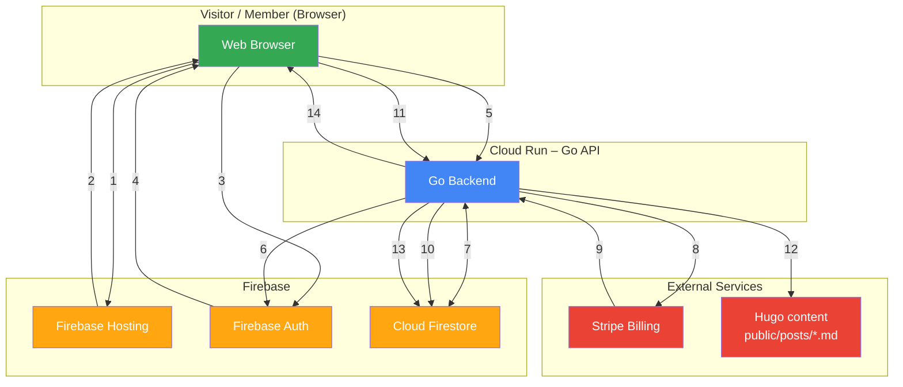

# System Components Overview

This system combines Firebase, Google Cloud Run, Stripe, and Firestore to create a membership-based content platform.

-   **1**. Browser loads static site from Firebase Hosting
-   **2**. Hosting serves HTML + JS + public posts
-   **3**. User logs in / registers using Firebase Auth (client SDK)
-   **4**. Firebase Auth returns ID token to browser
-   **5**. Frontend calls any Go API endpoint with Authorization: Bearer
-   **6**. Go API verifies token using Firebase Admin SDK
-   **7**. Go API reads/writes user profile, plan, Stripe IDs in Firestore
-   **8**. Go API creates Checkout Session or Billing Portal session in Stripe
-   **9**. Stripe sends webhooks (invoice.paid, subscription.deleted, etc.) to Go API
-   **10**. Go API updates subscription status and plan in Firestore
-   **11**. User requests a protected post (e.g. /post/premium-article)
-   **12**. Go API reads the Markdown/HTML file and parses front-matter category
-   **13**. Go API checks user’s current plan against post category
-   **14**. Go API returns full post (200) or 403 upgrade message

### 1\. Visitor / Client (Browser)

-   Loads frontend from Firebase Hosting
-   Uses Firebase Auth for login & identity
-   Calls Cloud Run API with JWT ID Tokens
-   Manages subscription status (upgrade, cancel, resume) via the Go API
-   Displays or restricts posts based on membership plan

### 2\. Firebase Hosting

-   Serves static frontend pages
-   Ensures SEO-friendly, fast delivery
-   Loads Firebase Web SDK for authentication
-   Redirects API calls to Go API backend

### 3\. Firebase Authentication

-   Handles user login & identity
-   Issues ID tokens for secure API calls
-   Auth state is shared with the Go backend via Firebase Admin SDK

### 4\. Cloud Run (Go API Backend)

This is the core business logic layer. It handles:

-   User registration
-   Membership creation
-   Stripe subscription creation
-   Stripe webhook verification
-   Membership cancellation / renewal
-   Post access control logic
-   Reads & writes to Firestore (user profiles + membership data)
-   Verifies Firebase ID tokens It interacts directly with Stripe for:
-   Subscription creation
-   Billing portal sessions
-   Webhooks for lifecycle events (invoice.paid, canceled, trial\_end, etc.)

### 5\. Stripe Billing

Responsible for:

-   Payment processing
-   Subscription plans
-   Billing cycles
-   Webhooks that notify the Go API about subscription status changes

### 6\. Firestore Database

Stores:

-   User profiles
-   Membership tier (Basic, Pro, Elite)
-   Stripe customer ID
-   Stripe subscription ID
-   Subscription status (active, canceled, past\_due, trialing)
-   Access rules for protected posts Cloud Run updates Firestore based on Stripe webhooks.

### 7\. Protected Content (Posts)

-   Stored in Google Cloud Storage buckets
-   Served conditionally based on membership tier attached to bucket metadata
-   Access is validated by the Go API before returning content
-   Front-matter specifies category in taxonomy (basic, pro, elite)

