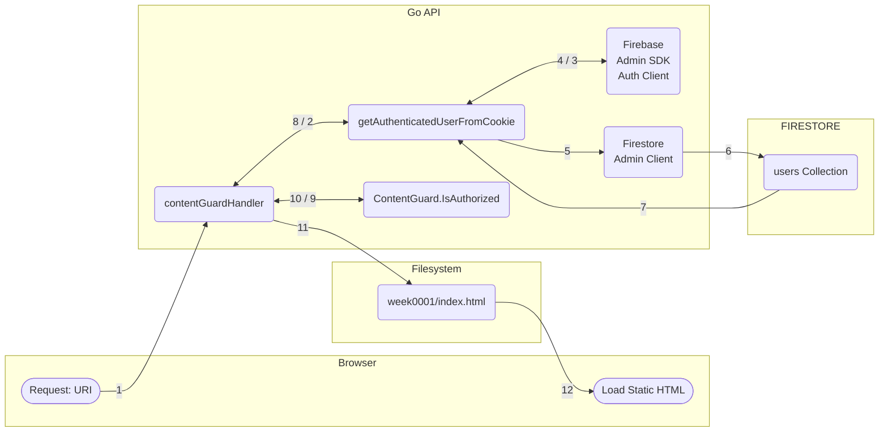

Users could to access posts ONLY if their plan matches the category specified in the front-matter of the markdown file.

### Workflow Diagram



### Process

-   **1.** Request URI: The user’s browser requests a restricted URL (e.g., `/posts/week0001`). The browser automatically attaches the stored `__session` cookie.
-   **2.** Check cookie: The handler calls `getAuthenticatedUserFromCookie(r)` to determine the user’s identity and plan.
-   **3.** Read `__session` cookie: The helper reads the `__session` cookie from the request headers.
-   **4.** Verify cookie: The helper sends the cookie value to the Admin SDK Auth Client (via `VerifySessionCookie`) to securely verify its validity and extract the user’s UID.
-   **5.** Get UID: Using the verified UID, the helper calls the Firestore Admin Client to read the user’s `plan` from the `users` collection.
-   **6.** Read plan/profile: The helper returns the full `AuthUser` struct, including the retrieved `Plan` (or `Plan="visitor"` if no cookie was found/verified).
-   **7.** Return `plan` (e.g. ‘pro’): The handler calls `contentGuard.IsAuthorized(requestPath, userPlan)`.
-   **8.** Return `AuthUser`: The Guard checks the requested path against its cached plan map (ContentGuard.permissions). If the user’s plan matches any required plan (or the content is unrestricted), access is granted.
-   **9a.** Check `IsAuthorized(path, 'pro')`: (If Authorized): The handler constructs the local file path (e.g., `public/posts/week0001/index.html`) and calls `http.ServeFile`.
-   **9b.** Check `IsAuthorized(path, 'pro')`:(If Denied): The handler sets HTTP Status 403 Forbidden and returns a custom HTML error page detailing the denial (including the user’s current plan).
-   **10.** Match found: The `ContentGuard.IsAuthorized` function returns true because the authenticated user’s Plan (e.g., ‘pro’) matches one of the categories required by the content. Authorization is granted.
-   **11.** Serve File: The Go API handler executes the success path. It maps the requested URL path (e.g., `/posts/week0001`) to the corresponding static file path (e.g., public/posts/week0001/index.html) and calls `http.ServeFile`.
-   **12** HTML/Content: The Go server streams the content of the authorized static HTML file from the filesystem back to the browser as the HTTP response.

### Permissions Map

Restricted content can be accessed only if this condition is true: User's `plan` matches the post's front-matter `categories`.

As we saw in step 8 of the process above, the guard checks the requested path against its cached plan map. This map is the `permissions` map.

The permissions map is generated once:

```go
type ContentGuard struct {
	permissions map[string][]string
	mu          sync.RWMutex
}

// Global variable contentGuard initializes an empty permissions map
var contentGuard = ContentGuard{permissions: make(map[string][]string)}

// This function populates the permissions map
func (cg *ContentGuard) Init() {
    // ...
}
```

If a new post is added, the permissions map is not updated. In order to update the permissions map everytime a new post is added, we need to change the way GitHub Actions builds the Hugo site. For information about building, check [Deploy](../deploy/).

