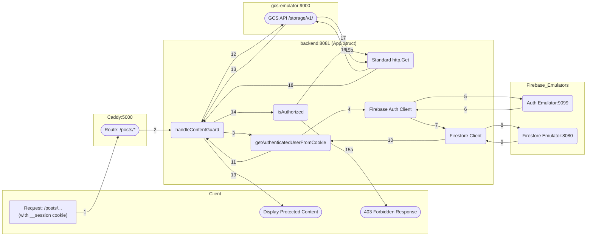
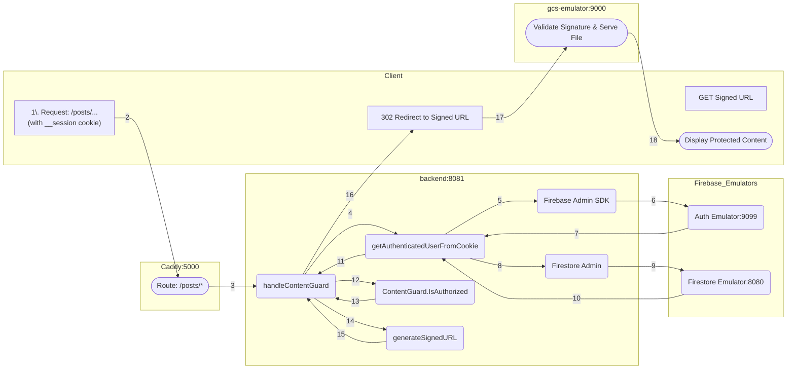

# Gated Content

## Introduction

Users can access posts ONLY if their plan matches the category specified in the front-matter of the markdown file of the post.

The Gated Content pattern securely delivers restricted files (like premium posts or documents) by strictly enforcing user authentication and authorization.

The entire workflow, from the initial user request to the final content display, is handled across four primary services: the Client (Browser), Caddy router (emulating Firebase Hosting), Go Backend (API), and the GCS Emulator.

Due to Firebase Hosting being the router, the most secure way to deliver the restricted content to the client is using one of these two methods:

1. Streaming the file directly from the Go Backend.
2. Generating a short time-limited **Signed URL** for content delivery.

On both cases, restricted pages (files) are stored in GCS (Google Cloud Storage).

* * *

## Scenario 1: Direct Streaming via SDK

In this scenario, the Go backend reads the file directly from GCS using the SDK and streams it to the user. This is the fastest and most secure method for small files and low traffic (<1MB files and <5000 visits day).

Direct Streaming via SDK: the wording reflects that the backend is no longer just a gatekeeper but the actual delivery vehicle for the content. Instead of delegating the final fetch to the client and storage provider, the backend takes full ownership of the data stream.

#### 1. Delegation of Responsibility

This architecture improves security and efficiency by clearly separating concerns across components:

| Component | Primary Responsibility | Key Feature |
| :--- | :--- | :--- |
| **Go Backend** | Authentication, Authz & Proxying | Verifies sessions via Firebase, evaluates the plan hierarchy, and streams gated content from GCS. |
| **Caddy Proxy** | Unified Entry Point | Forwards external requests to the Go Backend while ensuring a single-domain experience for the user. |
| **GCS Emulator** | Gated Metadata & Storage | Stores raw HTML posts and custom `required-plans` metadata, accessible only by internal backend requests. |
| **Firebase Emulators** | Identity & Profile Provider | Handles session validation (Auth) and stores user subscription levels (Firestore) for real-time lookups. |

#### 2. Pattern Implementation

Implementation of a gated content microservice pattern in the local development environment:

- **Authentication**: Firebase Auth manages secure session state via `__session` cookies. The Go backend leverages the Firebase Admin SDK to verify these tokens against the local Auth Emulator.
- **Authorization & Metadata**: The Go backend performs a real-time dual-check:
    1. It fetches the user's `plan` from Firestore.
    2. It fetches the object's `required-plans` from GCS metadata.
    3. It evaluates access using a defined hierarchy (`visitor` < `basic` < `pro` < `elite`).
- **Secure Content Delivery**: Content is never served directly from the public web. The Go backend acts as a **Secure Proxy**, initiating an internal REST request to GCS and streaming the binary data using `io.Copy`. This ensures GCS credentials and URLs are never exposed to the client.
- **Local Emulation Strategy**:
    - **Go Backend as Proxy**: Bypasses complex cloud signing logic by using a direct REST API call (`alt=media`) to the GCS emulator to retrieve raw file bytes.
    - **Metadata-Driven Guard**: Uses GCS custom metadata fields to store access rules, allowing content to be "gated" simply by tagging the file during the upload process (e.g., via the `uploader.go` script).

#### 2. Server Configuration

#### `Caddyfile` (for dev)

Simplify the backend block. Since Go is now streaming the file, Caddy does not need to intercept any response headers.

```caddy
    @backend path /api/* /posts/*
    handle @backend {
        reverse_proxy backend:8081
    }

```

#### `firebase.json` (for prod)

Ensure the rewrite rules point to the backend for the `/posts/` path.

```json
    "rewrites": [
      { "source": "/api/**", "destination": "http://backend:8081/api/**" },
      { "source": "/posts/**", "destination": "http://backend:8081/posts/**" },
      { "source": "**", "destination": "/index.html" }
    ]
```

#### 3. Diagram Workflow



#### 4. Process Steps

1. **Request Initiation**: The browser requests a protected URL, automatically sending the `__session` cookie.
2. **Caddy Routing**: Caddy forwards the request to the backend.
3. **Authentication Start**: The handler resolves the identity of the requester.
```
user := a.getAuthenticatedUserFromCookie(r)

```
4. **SDK Invocation**: The helper calls the Firebase SDK to verify the cookie.
```
token, err := a.auth.VerifySessionCookie(r.Context(), cookie.Value)

```
5. **Token Verification**: The SDK sends the cookie to the **Auth Emulator (:9099)**.
6. **UID Retrieval**: The Auth Emulator returns the verified UID and claims.
7. **Database Request**: The helper initiates a Firestore lookup.
```
dsnap, err := a.firestore.Collection("users").Doc(token.UID).Get(r.Context())

```
8. **Profile Lookup**: The client queries the **Firestore Emulator (:8080)**.
9. **Plan Retrieval**: The Firestore Emulator returns the document data.
```
userPlan, _ = data["plan"].(string)

```
10. **Client Return**: Plan data is passed back to the `getAuthenticatedUserFromCookie` helper.
11. **Return User Profile**: The helper returns the full `AuthUser` struct.
```
return &AuthUser{UID: token.UID, Email: token.Claims["email"].(string), Plan: userPlan, ...}

```
12. **Metadata Fetch**: The handler requests attributes from the **GCS Emulator (:9000)**.
```
attrs, err := a.storage.Bucket(a.bucket).Object(objectPath).Attrs(ctx)

```
13. **Requirements Retrieval**: The GCS Emulator returns the object's custom metadata.
```
meta := attrs.Metadata["required-plans"]

```
14. **Authorization Logic**: The handler compares the user's plan level against the requirements.
```
if !isAuthorized(userPlan, required) { ... }

```
15. **Authorization Outcome**:
* **15a (Denied)**: Returns `403 Forbidden`.
    ```
    w.WriteHeader(http.StatusForbidden)
    fmt.Fprintf(w, "<html><body><h1>Access Denied</h1>...")

    ```
* **15b (Authorized)**: Continues to content retrieval.

16. **Media Request**: The backend initiates an `http.Get` request with `alt=media`.
```
resp, err := http.Get(emulatorURL)

```
17. **Content Delivery**: The GCS Emulator streams raw binary data back to the backend.
18. **Data Reception**: The backend sets the headers for the incoming stream.
```
w.Header().Set("Content-Type", resp.Header.Get("Content-Type"))
w.Header().Set("Cache-Control", "no-store")

```
19. **Direct Stream to Client**: The backend pipes the data directly to the user's browser.
```
io.Copy(w, resp.Body)
```

---

## Scenario 2: Signed URL Redirect

> [!DANGER]
> The documentation for Scenario 2: Signed URL Redirect is currently in design stage. It can be incorrect.

In this scenario, the Go backend generates a temporary link and instructs the browser to fetch the file directly from GCS via an HTTP 302 redirect.

Signed URL Redirect: the explanation shifts the focus from the backend being a "content provider" to being a "security validator." In this model, the backend issues a temporary "pass" (the Signed URL) and offloads the heavy lifting of data transfer to the storage provider.

#### 1. Delegation of Responsibility

This architecture improves efficiency and scalability by offloading data delivery to specialized storage infrastructure. The backend remains the source of truth for security while the storage layer handles high-volume traffic.

| Component | Primary Responsibility | Key Feature |
| :--- | :--- | :--- |
| **Go Backend** | **Authorization & Key Generation** | Validates user identity and plan; generates a cryptographically signed, short-lived URL as a temporary access token. |
| **Caddy Proxy** | **Transparent Redirection** | (Local) Handles the routing of the signed request back to the emulator, ensuring the client-to-storage handshake mirrors production. |
| **GCS Emulator / GCS** | **Scalable Content Delivery** | Validates the signature and expiration of the URL; serves the actual bytes directly to the client with high throughput. |

Implementation of a Gated Content Microservice Pattern (Signed URL Redirect)

- **Authentication**: Firebase Auth manages the secure user session via the `__session cookie`.
- **Authorization**: The Go backend interceptor validates the session and confirms the user’s plan level (e.g., Basic, Pro, Elite) before granting a "key."
- **Secure Content Delivery**: The Go backend generates a time-limited Signed URL. The user is then redirected (HTTP 302) to this URL, allowing the browser to fetch the content directly from the bucket. This reduces backend CPU/Memory load.
- **Local Emulation**:
    - **Caddy Reverse Proxy**: Acts as a necessary intermediary to bridge the local domain to the GCS Emulator, allowing the browser to follow the redirect as if it were communicating with the public Google Cloud API.
    - **Fake GCS Server**: Validates the manually constructed signature and serves the restricted files from the local data mount.

#### 2. Server Configuration

#### `Caddyfile` (for dev)

Ensure the GCS proxy is active so that when the browser follows the redirect to `/gcs-content/`, Caddy can route it to the emulator.

```caddy
    # Ensure this block exists so browser can reach emulator after redirect
    @gcs_proxy path_regexp gcs_content ^/gcs-content/.*
    handle @gcs_proxy {
        uri strip_prefix /gcs-content
        reverse_proxy gcs-emulator:9000 {
            header_up Host localhost:9000
        }
    }

    @backend path /api/* /posts/*
    handle @backend {
        reverse_proxy backend:8081
    }

```

#### `firebase.json` (for prod)

The configuration remains identical to Scenario 1. Firebase Hosting routes the initial request to Cloud Run, which then sends the redirect response back to the user's browser.

Ensure the rewrite rules point to the backend for the `/posts/` path.

```json
    "rewrites": [
      { "source": "/api/**", "destination": "http://backend:8081/api/**" },
      { "source": "/posts/**", "destination": "http://backend:8081/posts/**" },
      { "source": "**", "destination": "/index.html" }
    ]
```

#### 3. Diagram Workflow



#### 4. Process Steps

1. **Request Initiation**: The browser requests a protected URL (e.g., `/posts/week0003/`), sending the `__session` cookie.
2. **Caddy Routes Request**: The Caddy proxy receives the traffic and forwards it to the Go Backend on port `:8081`.
3. **Handler Invocation**: The Go Backend receives the request in `handleContentGuard`.
4. **Read Session Cookie**: The handler calls `getAuthenticatedUserFromCookie` to identify the user.
5. **Verify Token**: The helper uses the Firebase Admin SDK to verify the session cookie.
6. **Auth Emulator Check**: The Firebase Auth Emulator validates the session.
7. **UID Returned**: The unique User ID is returned to the helper function.
8. **Fetch User Profile**: The helper queries Firestore to retrieve the user's subscription plan.
9. **Firestore Emulator Lookup**: The Firestore Emulator returns the plan level (e.g., `elite`).
10. **Return AuthUser**: The helper returns the full `AuthUser` profile to the handler.
11. **Authorization Check**: The handler invokes contentGuard.IsAuthorized to check if the user's plan permits access to the specific permPath.
12. **Authorization Outcome**:
     - **Denied**: The handler returns a `403 Forbidden` status with an HTML error message.
     - **Authorized**: The process continues to the fetch stage.
13. **Generate Signed URL**: The handler calls `generateSignedURL`.
14. **Signature Creation**: In production, the SDK creates a V4 signature; in emulator mode, it manually constructs a URL pointing to the storage service.
15. **Signed URL Returned**: The short-lived URL (containing the access token) is returned to the handler.
16. **Browser Redirect**: Instead of streaming bytes, the handler sends an `http.Redirect` (302 Found) to the browser, providing the Signed URL as the new location.
17. **Direct Fetch**: The browser automatically makes a new GET request directly to the GCS Emulator (or GCS Production) using the Signed URL.
18. **GCS Validation**: The storage service validates the signature and expiration. If valid, it serves the file bytes.
19. **Display Content**: The browser receives and renders the protected content directly from the storage source.

## Scenario 1 vs Scenario 2

This documentation distinguishes between your current **Direct Stream** architecture and the alternative **Signed URL** approach, mapping them to your specific local development setup (**Caddy + Go**) and production environment (**Firebase + GCS**).

| Feature | Your Current Process (Direct Stream) | Alternative (302 Redirect) |
| :--- | :--- | :--- |
| **Go Code** | `io.Copy(w, resp.Body)` (via `http.Get`) | `http.Redirect(w, r, signedURL, 302)` |
| **Caddy** | **Simple Proxy**: Forwards `/posts/*` directly to Go. | **Request Router**: Forwards to Go, then routes browser to GCS. |
| **Firebase Hosting** | **Rewrite Engine**: Proxies request to Backend Function. | **Edge Router**: Proxies to Go, then permits GCS redirect. |
| **User Hops** | **1 (Fastest)**: Browser ↔ Go Backend. | **2**: Browser → Go Backend → GCS. |
| **Security** | **Maximum**: GCS/Bucket paths are fully hidden from user. | **Balanced**: GCS bucket URL is briefly exposed to browser. |
| **Performance** | Higher Backend Bandwidth (Backend pipes all data). | **Highly Scalable**: Offloads bandwidth to Google’s Edge. |

* * *

### Component Roles & Terminology

| Component | Your Process: Direct Streaming | Alternative: Signed URL Redirect |
| :--- | :--- | :--- |
| **Go Backend** | **Secure Proxy**: Authenticates user and actively pipes bytes from storage to client. | **Authorization Server**: Authenticates user and issues a temporary "pass" (Signed URL). |
| **Local Proxy** (Caddy) | **Ingress**: Forwards inbound traffic directly to the Go backend port `:8081`. | **Request Router**: Directs auth request to Go, then routes redirect to GCS Emulator. |
| **Prod Hosting** (Firebase) | **Rewrite Engine**: Uses `firebase.json` to trigger the Backend Function while keeping user on same URL. | **Edge Router**: Rewrites to backend for auth, then allows browser to jump to GCS domain. |
| **Storage** (GCS) | **Private Origin**: Hidden from public; only responds to internal backend requests. | **Resource Server**: Serves content directly to browser after validating URL signature. |

* * *

### Implementation Details by Environment

#### **Scenario 1: Direct Streaming (The "Hidden" Pattern)**
*This is the current implementation used in `main.go` to enforce Gated Content.*

In this model, the user stays on your domain, and your Go backend acts as a secure proxy to fetch and pipe the data.

| Feature | Local Dev (Caddy + Emulator) | Production (Firebase + GCS) |
| :--- | :--- | :--- |
| **Routing** | Caddy `reverse_proxy` to port `:8081`. | `firebase.json` **Rewrite** to Backend Function. |
| **Data Flow** | GCS Emulator → Go Backend → Caddy → User. | GCS → Go Backend → Firebase Hosting → User. |
| **Configuration** | `Caddyfile`: `reverse_proxy /posts/* backend:8081` | `firebase.json`: `{"source": "/posts/**", "function": "app"}` |
| **Mechanism** | Standard `http.Get` via REST API (`alt=media`). | GCS SDK `NewReader` or internal API call. |
| **Security** | Internal network fetch (No Signatures). | IAM-based internal fetch (No public URLs). |
| **Path Logic** | **Sanitization**: Automatically appends `index.html` to directory requests. | **Sanitization**: Maps URL paths to GCS Object Keys. |
| **Caching** | **`Cache-Control: no-store`** enforced for gated items. | Managed via Backend response headers. |


#### **Scenario 2: Signed URL Redirect (The "Scalable" Pattern)**
*This is the alternative model for offloading high-bandwidth delivery to Google's infrastructure.*

In this model, the user is temporarily redirected (302) to the storage provider after the backend validates their subscription.

| Feature | Local Dev (Caddy + Emulator) | Production (Firebase + GCS) |
| :--- | :--- | :--- |
| **Routing** | Caddy routes to Go, then to Emulator port. | Firebase rewrites to Go, then redirects to GCS. |
| **Data Flow** | Go sends 302 → User fetches from Emulator. | Go sends 302 → User fetches from GCS. |
| **Configuration** | `generateSignedURL` uses Emulator Host/Port. | `generateSignedURL` uses `storage.googleapis.com`. |
| **Mechanism** | `http.Redirect` to unsigned/fake-signed URL. | `http.Redirect` to cryptographic V4 Signed URL. |
| **Security** | Manual testing (Signatures bypassed/faked). | Cryptographic RSA signatures with expiration. |

* * *

### Technical Nuances of Our Process

- **Authentication**: Firebase Auth manages secure session state via `__session` cookies. The Go backend validates the session cookie and performs a real-time access check against the user’s subscription plan (e.g., Basic, Pro, Elite) stored in Firestore.
- **Path Construction**: Our handler cleans the URL path and appends `index.html` for directory requests. This ensures that Hugo-generated "Pretty URLs" (e.g., `/posts/week0005/`) correctly resolve to the storage object (`posts/week0005/index.html`).
- **Secure Content Delivery**: By initiating an internal request to GCS and streaming the response, we ensure the storage bucket URL and internal naming conventions are never exposed to the public. This also allows us to dynamically set MIME types and security headers.
- **Local Emulation Strategy**:
    - **Go Backend as Proxy**: To simplify local development, the backend bypasses complex cloud signing logic by using a direct REST API call (`alt=media`) to the GCS emulator to retrieve raw file bytes.
    - **GCS Emulator**: Serves as the internal object store, mapping local directories to virtual buckets for the backend to consume via localhost ports.

* * *

### Documentation Summary

* **Your Chosen Pattern (Direct Streaming):** Emphasizes **Total Control**. Your Go Backend acts as a **Streaming Gateway**. The local configuration is a simple passthrough, and the user never knows GCS exists. This is ideal for your "Gated Content" model because it prevents users from sharing URLs to bypass the subscription check.
  
* **The Scalable Alternative (Signed URLs):** Emphasizes **Resource Efficiency**. The Go Backend is a **Gatekeeper**. You would only switch to this if your traffic grew so large that the Go Backend could no longer handle the bandwidth of "piping" the HTML files to thousands of concurrent users.

**Why Scenario 1 is best for your current Project:**
1.  **Strict Gating**: Since you check the subscription level in real-time before fetching the bytes, Direct Streaming ensures no one can "sniff" a GCS link and share it.
2.  **Ease of Testing**: Using `http.Get` against the GCS Emulator is much simpler than generating local cryptographic signatures.
3.  **SEO/UX**: Users always stay on `yourdomain.com/posts/...` without flickering or redirecting to `storage.googleapis.com`.

* **Use Scenario 1:** if you want absolute control over the data stream, need to prevent caching at all costs, or want to keep your storage buckets entirely hidden from the browser.
* **Use Scenario 2:** if you are serving large files (video, high-res images, large PDFs) and want to ensure your Go backend doesn't crash or slow down under heavy concurrent traffic.

* * *

## Where Go API gets Content Permissions

The Go API identifies content access rules dynamically at runtime by querying the **metadata** of objects stored in Google Cloud Storage (GCS). This ensures that permissions are decoupled from the Go binary and can be updated without redeploying the application.

### 1. Metadata-Driven Authorization
Instead of maintaining a static permissions map, the Go backend performs a real-time check against the specific file being requested.

* **Source of Truth**: The GCS Bucket (or GCS Emulator in development) stores both the content bytes and the access requirements.
* **Metadata Key**: The system specifically looks for a custom metadata attribute named `required-plans` on each GCS object.
* **Dynamic Resolution**: Access rules are fetched on every request, allowing for immediate updates if a file's permission level is changed in storage.

### 2. Development Environment Workflow
In development, the Go API interacts with the GCS Emulator to retrieve both object attributes and raw data.

1.  **Emulator Connection**: The Go Backend connects to the GCS Emulator (typically port `:9000`) via the `STORAGE_EMULATOR_HOST` configuration.
2.  **Attribute Retrieval**: When a user requests a path (e.g., `/posts/week0005/`), the backend calls the `getRequiredPlans` helper.
3.  **API Call**: This helper uses the `gcsClient.Bucket().Object().Attrs()` method to fetch the object's metadata directly from the emulator.
4.  **Plan Comparison**: The backend extracts the `required-plans` string (e.g., `"pro,elite"`) and compares it against the user's plan level retrieved from Firestore.

### 3. Production Workflow
The production environment maintains strict parity with development, ensuring consistent authorization logic.

1.  **Stateless Execution**: The Go container in Cloud Run does not require local access to Hugo source files or a pre-compiled JSON permissions map.
2.  **Centralized Rules**: Because permissions are stored as metadata on the GCS objects themselves, the deployment process simply involves uploading the Hugo-generated HTML files and tagging them with the appropriate `required-plans` metadata.
3.  **Hierarchy-Based Guard**: The `isAuthorized` function evaluates access based on a defined level hierarchy: `visitor (0) < basic (1) < pro (2) < elite (3)`.

---

### Key Implementation Snippets


**Metadata Retrieval (`handleContentGuard`)**
This snippet fetches the "Access Control List" directly from the storage provider's metadata for the specific object:

```go
	attrs, err := a.storage.Bucket(a.bucket).Object(objectPath).Attrs(ctx)
	if err != nil {
		log.Printf("GCS Metadata error for %s: %v", objectPath, err)
		http.Error(w, "Content not found", http.StatusNotFound)
		return
	}

	meta := attrs.Metadata["required-plans"]
	var required []string
	if meta != "" {
		for p := range strings.SplitSeq(meta, ",") {
			required = append(required, strings.TrimSpace(p))
		}
	}
```

**Real-Time Authorization Logic (`isAuthorized`)**
The backend compares the user's current subscription level against the requirements fetched from GCS:

```go
func isAuthorized(userPlan string, required []string) bool {
	if len(required) == 0 {
		return true
	}
	hierarchy := map[string]int{"visitor": 0, "basic": 1, "pro": 2, "elite": 3}
	for _, r := range required {
		if hierarchy[userPlan] >= hierarchy[r] {
			return true
		}
	}
	return false
}

func getEnv(key, fallback string) string {
	if v := os.Getenv(key); v != "" {
		return v
	}
	return fallback
}
```

* * *

## Automatic deployment with GitHub Actions

If you create your posts in your computer with Hugo and push to GitHub, you can use GitHub actions to automate the process of uploading the file to GCS and tagging the file.

To implement this workflow, your GitHub Actions script needs to perform three primary tasks: build the Hugo site, identify the plan requirements from your Markdown files, and upload the resulting HTML to GCS while applying the `required-plans` metadata.

Since your Go Backend is metadata-driven, you don't need to rebuild it; once the file is in GCS with the correct tag, the backend will immediately recognize the new permissions.

### GitHub Actions Workflow

```yaml
name: Deploy Content to GCS

on:
  push:
    branches:
      - main
    paths:
      - 'content/posts/**'

jobs:
  deploy:
    runs-on: ubuntu-latest
    steps:
      - name: Checkout Source
        uses: actions/checkout@v4
        with:
          submodules: true
          fetch-depth: 0

      - name: Setup Hugo
        uses: peaceiris/actions-hugo@v2
        with:
          hugo-version: 'latest'
          extended: true

      - name: Build Hugo Site
        run: hugo --minify

      - name: Authenticate to Google Cloud
        uses: google-github-actions/auth@v2
        with:
          credentials_json: ${{ secrets.GCP_SA_KEY }}

      - name: Upload and Tag Gated Content
        run: |
          # 1. Upload public content (Excluding posts to handle them with metadata)
          gsutil -m rsync -r -x "posts/.*" public/ gs://${{ secrets.GCS_BUCKET }}/

          # 2. Process and Upload Gated Posts
          find content/posts -name "*.md" | while read -r md_file; do
            # Extract folder name (slug)
            slug=$(basename $(dirname "$md_file"))
            
            # Logic for TOML front-matter: categories = ['basic']
            # We extract the value inside the single quotes
            plan=$(grep "categories =" "$md_file" | cut -d "'" -f2)
            
            # Default to visitor if no category is found
            if [ -z "$plan" ]; then plan="visitor"; fi

            echo "Deploying $slug with required-plans metadata: $plan"

            # Upload the folder and apply the metadata tag required by main.go
            gsutil -h "x-goog-meta-required-plans:$plan" cp -r "public/posts/$slug/" "gs://${{ secrets.GCS_BUCKET }}/posts/"
          done
```

### How this works

1. **Pathing:** The script preserves the directory structure (`/posts/slug/index.html`). Your backend's `path.Join(GCSBucket, objectPath, "index.html"`) logic will correctly resolve these paths.
2. **Metadata Identification:** The `gsutil -h "x-goog-meta-required-plans:$plan"` command ensures that when `attrs.Metadata["required-plans"`] is called in Go, it returns the value you defined in your Markdown frontmatter.
3. **Zero Downtime:** Since your backend uses `getRequiredPlans` at runtime, it fetches the fresh metadata from GCS the moment the `gsutil` command finishes. No restart is required.
4. **No Backend Change:** Your Go backend remains untouched. It will still call `attrs.Metadata["required-plans"`], which `gsutil` has now populated with the value from your Hugo `categories`.
5. **Automatic Provisioning:** Every time you push a new post to GitHub, this action builds the HTML and "stamps" the access level directly onto the file in GCS.

### Plan Hierarchy Reference

Your backend will enforce access based on this table:

| Front-matter Source | Metadata Tag Applied (`required-plans`) | Access Logic |
| :--- | :--- | :--- |
| `categories = ['visitor']` | `visitor` | Accessible by everyone. |
| `categories = ['basic']` | `basic` | Basic, Pro, and Elite tiers. |
| `categories = ['pro']` | `pro` | Pro and Elite tiers. |
| `categories = ['elite']` | `elite` | Elite tier only. |
| *(No category found)* | `visitor` | Falls back to public access. |

* * *
## GCS Upload Guide: Applying Access Metadata

This guide explains how to upload static site content to Google Cloud Storage (GCS) while applying the custom metadata required by the Go Backend's `handleContentGuard` logic.

### 1. The Metadata Schema
The Go Backend identifies access requirements by querying a custom metadata key. This allows the "Content Guard" to be entirely stateless.

| Plan Level | Metadata Value | Logic Result |
| :--- | :--- | :--- |
| **Public** | *(None or Empty)* | Accessible by everyone (including visitors). |
| **Basic** | `basic` | Accessible by Basic, Pro, and Elite users. |
| **Pro** | `pro` | Accessible by Pro and Elite users. |
| **Elite** | `elite` | Accessible by Elite users only. |


---

### 2. Uploading via `gsutil` (CLI)

When uploading files via the Google Cloud CLI or shell script, use the `-h` flag to attach the metadata.

**To upload a specific post that requires a "Pro" plan:**
```bash
gsutil -h "x-goog-meta-required-plans:pro" cp ./public/posts/week0005/index.html gs://your-bucket-name/posts/week0005/index.html
```

**To upload an entire directory as "Basic" access:**
```bash
gsutil -m -h "x-goog-meta-required-plans:basic" cp -r ./public/posts/ gs://your-bucket-name/posts/
```

### 3. Automated Deployment (GitHub Actions)

If you use the `google-github-actions/upload-cloud-storage` action, you can define metadata globally or per-file.

```yaml
- name: 'Upload Gated Content'
  uses: 'google-github-actions/upload-cloud-storage@v2'
  with:
    path: 'public/posts'
    destination: 'your-bucket-name/posts'
    # This applies the 'pro' requirement to all files in this upload batch
    metadata: |-
      {
        "required-plans": "pro"
      }
```

### 4. Local Development (Go Uploader Script)

In your local environment, you may have a Go script to seed the **GCS Emulator**. Ensure it uses the `storage.Writer` to set the metadata map:

```go
// Example snippet for a local uploader
func uploadFile(ctx context.Context, client *storage.Client, bucket, object, plan string) error {
    wc := client.Bucket(bucket).Object(object).NewWriter(ctx)
    
    // This maps exactly to what getRequiredPlans() looks for in main.go
    wc.Metadata = map[string]string{
        "required-plans": plan, 
    }
    
    // ... copy file content to wc ...
    return wc.Close()
}
```

### 5. Verifying Metadata in the Emulator

To verify that your metadata was applied correctly in the local development environment, you can query the GCS Emulator's REST API directly in your browser or via `curl`:
Bash

```BASH
curl http://localhost:9000/storage/v1/b/content/o/posts%2Fweek0005%2Findex.html
```

**Look for the metadata object in the JSON response:**

```json
{
  "name": "posts/week0005/index.html",
  "bucket": "content",
  "metadata": {
    "required-plans": "pro"
  }
}
```

### 6. Summary of Flow

1. **Hugo Build:** Generates static HTML in `/public`.
2. **Upload:** Files are moved to GCS; metadata is attached based on the post's category.
3. **Request:** User visits the site; Go Backend fetches metadata via `Attrs()`.
4. **Enforcement:** `isAuthorized()` compares User Plan vs. Metadata Plan.
5. **Stream:** Content is served only if levels match.

* * *
