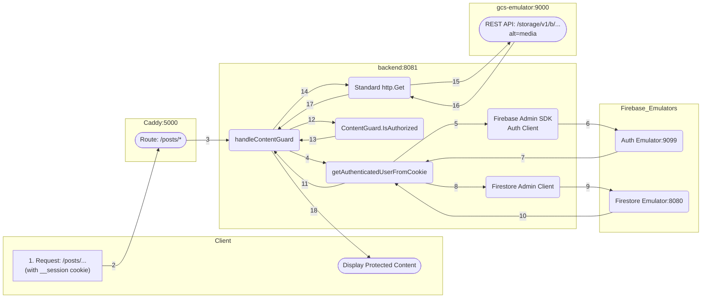
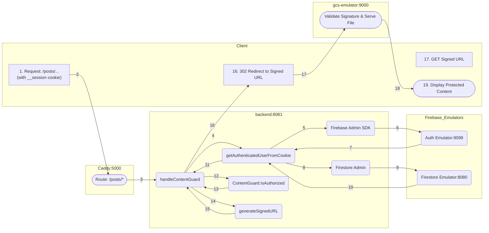

# Gated Content

## Introduction

Users can access posts ONLY if their plan matches the category specified in the front-matter of the markdown file of the post.

The Gated Content pattern securely delivers restricted files (like premium posts or documents) by strictly enforcing user authentication and authorization.

The entire workflow, from the initial user request to the final content display, is handled across four primary services: the Client (Browser), Caddy router (emulating Firebase Hosting), Go Backend (API), and the GCS Emulator.

Due to Firebase Hosting being the router, the most secure way to deliver the restricted content to the client is using one of these two methods:

1. Streaming the file directly from the Go Backend.
2. Generating a short time-limited **Signed URL** for content delivery.

On both cases, restricted pages (files) are stored in GCS.

* * *

## Scenario 1: Direct Streaming via SDK

In this scenario, the Go backend reads the file directly from GCS using the SDK and streams it to the user. This is the fastest and most secure method for small files and low traffic (<1MB files and <5000 visits day).

Direct Streaming via SDK: the wording reflects that the backend is no longer just a gatekeeper but the actual delivery vehicle for the content. Instead of delegating the final fetch to the client and storage provider, the backend takes full ownership of the data stream.


#### 1. Delegation of Responsibility

This architecture improves security and efficiency by clearly separating concerns across components:

| Component              | Primary Responsibility        | Key Feature                                                                                                            |
| :--------------------- | :---------------------------- | :--------------------------------------------------------------------------------------------------------------------- |
| **Go Backend**         | Authorization & Data Streaming | Validates users, checks `ContentGuard` permissions, and actively fetches/pipes bytes from storage to the client.             |
| **Caddy Proxy**        | Entry Point Routing    | Acts as the primary ingress, forwarding external requests to the Go Backend while maintaining a single domain for the user.  |
| **GCS Emulator / GCS** | Internal Storage Provider              | Acts as a private data source that only responds to internal backend requests, keeping the raw storage layer hidden from the public. |


Implementation of a gated content microservice pattern in the local development environment:

- **Authentication**: Firebase Auth manages secure session state via cookies.
- **Authorization**: The Go backend validates the session cookie and performs a real-time access check against the user’s subscription plan (e.g., Basic, Pro, Elite).
- **Secure Content Delivery**: The Go backend initiates an internal request to GCS and streams the response directly to the user. This ensures the storage URL is never exposed and content can be protected with `Cache-Control: no-store`.
- **Local Emulation**:
    - **Go Backend as proxy**: Bypasses complex signing logic by using a direct REST API call (`alt=media`) to the emulator to retrieve raw file bytes.
    - **GCS Emulator**: Serves as the internal object store, mapping local directories to virtual buckets for the backend to consume.

#### 2. Server Configuration

#### `Caddyfile` (for dev)

Simplify the backend block. Since Go is now streaming the file, Caddy does not need to intercept any response headers.

```caddy
    @backend path /api/* /posts/*
    handle @backend {
        reverse_proxy backend:8081
    }

```

#### `firebase.json` (for prod)

Ensure the rewrite rules point to the backend for the `/posts/` path.

```json
    "rewrites": [
      { "source": "/api/**", "destination": "http://backend:8081/api/**" },
      { "source": "/posts/**", "destination": "http://backend:8081/posts/**" },
      { "source": "**", "destination": "/index.html" }
    ]
```

#### 3. Diagram Workflow



#### 4. Process Steps

1. **Request Initiation**: The browser requests a protected URL (e.g., `/posts/week0003/`), sending the `__session` cookie.
2. **Caddy Routes Request**: The Caddy proxy receives the traffic and forwards it to the Go Backend on port `:8081`.
3. **Handler Invocation**: The Go Backend receives the request in `handleContentGuard`.
4. **Read Session Cookie**: The handler calls `getAuthenticatedUserFromCookie` to identify the user.
5. **Verify Token**: The helper uses the Firebase Admin SDK to verify the session cookie.
6. **Auth Emulator Check**: The Firebase Auth Emulator validates the session.
7. **UID Returned**: The unique User ID is returned to the helper function.
8. **Fetch User Profile**: The helper queries Firestore to retrieve the user's subscription plan.
9. **Firestore Emulator Lookup**: The Firestore Emulator returns the plan level (e.g., `elite`).
10. **Return AuthUser**: The helper returns the full `AuthUser` profile to the handler.
11. **Authorization Check**: The handler invokes contentGuard.IsAuthorized to check if the user's plan permits access to the specific permPath.
12. **Authorization Outcome**:
     - **Denied**: The handler returns a `403 Forbidden` status with an HTML error message.
     - **Authorized**: The process continues to the fetch stage.
13. **Path Construction**: The handler sanitizes the request path and ensures it targets `index.html` for directory requests.
14. **Direct API Fetch**: The handler bypasses the SDK and initiates a standard `http.Get` request to the GCS Emulator's REST API.
15. **Media Request**: The request hits `gcs-emulator:9000` using the `alt=media` parameter and a URL-encoded object path to retrieve raw file bytes.
16. **GCS Serves Content**: The GCS Emulator locates the file (e.g., `/data/content/posts/week0003/index.html`) and returns the binary data.
17. **Stream to Backend**: The Go Backend receives the data stream and sets the appropriate `Content-Type` and `Cache-Control: no-store` headers.
18. **Direct Stream to Client**: Using `io.Copy`, the backend pipes the bytes directly to the browser's response, completing the proxy flow.

---

## Scenario 2: Signed URL Redirect

In this scenario, the Go backend generates a temporary link and instructs the browser to fetch the file directly from GCS via an HTTP 302 redirect.

Signed URL Redirect: the explanation shifts the focus from the backend being a "content provider" to being a "security validator." In this model, the backend issues a temporary "pass" (the Signed URL) and offloads the heavy lifting of data transfer to the storage provider.

#### 1. Delegation of Responsibility

This architecture improves efficiency and scalability by offloading data delivery to specialized storage infrastructure. The backend remains the source of truth for security while the storage layer handles high-volume traffic.

| Component | Primary Responsibility | Key Feature |
| :--- | :--- | :--- |
| **Go Backend** | **Authorization & Key Generation** | Validates user identity and plan; generates a cryptographically signed, short-lived URL as a temporary access token. |
| **Caddy Proxy** | **Transparent Redirection** | (Local) Handles the routing of the signed request back to the emulator, ensuring the client-to-storage handshake mirrors production. |
| **GCS Emulator / GCS** | **Scalable Content Delivery** | Validates the signature and expiration of the URL; serves the actual bytes directly to the client with high throughput. |

Implementation of a Gated Content Microservice Pattern (Signed URL Redirect)

- **Authentication**: Firebase Auth manages the secure user session via the `__session cookie`.
- **Authorization**: The Go backend interceptor validates the session and confirms the user’s plan level (e.g., Basic, Pro, Elite) before granting a "key."
- **Secure Content Delivery**: The Go backend generates a time-limited Signed URL. The user is then redirected (HTTP 302) to this URL, allowing the browser to fetch the content directly from the bucket. This reduces backend CPU/Memory load.
- **Local Emulation**:
    - **Caddy Reverse Proxy**: Acts as a necessary intermediary to bridge the local domain to the GCS Emulator, allowing the browser to follow the redirect as if it were communicating with the public Google Cloud API.
    - **Fake GCS Server**: Validates the manually constructed signature and serves the restricted files from the local data mount.

#### 2. Server Configuration

#### `Caddyfile` (for dev)

Ensure the GCS proxy is active so that when the browser follows the redirect to `/gcs-content/`, Caddy can route it to the emulator.

```caddy
    # Ensure this block exists so browser can reach emulator after redirect
    @gcs_proxy path_regexp gcs_content ^/gcs-content/.*
    handle @gcs_proxy {
        uri strip_prefix /gcs-content
        reverse_proxy gcs-emulator:9000 {
            header_up Host localhost:9000
        }
    }

    @backend path /api/* /posts/*
    handle @backend {
        reverse_proxy backend:8081
    }

```

#### `firebase.json` (for prod)

The configuration remains identical to Scenario 1. Firebase Hosting routes the initial request to Cloud Run, which then sends the redirect response back to the user's browser.

Ensure the rewrite rules point to the backend for the `/posts/` path.

```json
    "rewrites": [
      { "source": "/api/**", "destination": "http://backend:8081/api/**" },
      { "source": "/posts/**", "destination": "http://backend:8081/posts/**" },
      { "source": "**", "destination": "/index.html" }
    ]
```

#### 3. Diagram Workflow



#### 4. Process Steps

1. **Request Initiation**: The browser requests a protected URL (e.g., `/posts/week0003/`), sending the `__session` cookie.
2. **Caddy Routes Request**: The Caddy proxy receives the traffic and forwards it to the Go Backend on port `:8081`.
3. **Handler Invocation**: The Go Backend receives the request in `handleContentGuard`.
4. **Read Session Cookie**: The handler calls `getAuthenticatedUserFromCookie` to identify the user.
5. **Verify Token**: The helper uses the Firebase Admin SDK to verify the session cookie.
6. **Auth Emulator Check**: The Firebase Auth Emulator validates the session.
7. **UID Returned**: The unique User ID is returned to the helper function.
8. **Fetch User Profile**: The helper queries Firestore to retrieve the user's subscription plan.
9. **Firestore Emulator Lookup**: The Firestore Emulator returns the plan level (e.g., `elite`).
10. **Return AuthUser**: The helper returns the full `AuthUser` profile to the handler.
11. **Authorization Check**: The handler invokes contentGuard.IsAuthorized to check if the user's plan permits access to the specific permPath.
12. **Authorization Outcome**:
     - **Denied**: The handler returns a `403 Forbidden` status with an HTML error message.
     - **Authorized**: The process continues to the fetch stage.
13. **Generate Signed URL**: The handler calls `generateSignedURL`.
14. **Signature Creation**: In production, the SDK creates a V4 signature; in emulator mode, it manually constructs a URL pointing to the storage service.
15. **Signed URL Returned**: The short-lived URL (containing the access token) is returned to the handler.
16. **Browser Redirect**: Instead of streaming bytes, the handler sends an `http.Redirect` (302 Found) to the browser, providing the Signed URL as the new location.
17. **Direct Fetch**: The browser automatically makes a new GET request directly to the GCS Emulator (or GCS Production) using the Signed URL.
18. **GCS Validation**: The storage service validates the signature and expiration. If valid, it serves the file bytes.
19. **Display Content**: The browser receives and renders the protected content directly from the storage source.

## Scenario 1 vs Scenario 2

Here is the comprehensive documentation table for both scenarios, distinguishing between your local development setup (**Caddy**) and your production environment (**Firebase Hosting**).

| Feature | Scenario 1 (Direct Stream) | Scenario 2 (302 Redirect) |
| --- | --- | --- |
| **Go Code** | `io.Copy(w, gcsReader)` | `http.Redirect(w, r, signedURL, 302)` |
| **Caddy** | Simple Proxy: Forwards requests to Go. | Request Router: Routes to Go, then to GCS Emulator. |
| **Firebase Hosting** | Rewrite Engine: Proxies requests to Go | Edge Router: Proxies to Go, then permits GCS redirect. |
| **User Hops** | 1 (Fastest) Browser ↔ Backend. | 2 (Browser follows redirect) Browser → Backend → GCS. |
| **Security** | Maximum: GCS fully hidden from user. | Balanced: GCS URL briefly exposed to browser |
| **Performance** | Higher Backend CPU/Bandwidth usage. | Highly Scalable (Offloads bandwidth to GCS). |


### Component Roles & Terminology

| Component | Scenario 1: Direct Streaming | Scenario 2: Signed URL Redirect |
| --- | --- | --- |
| **Go Backend** | **Content Proxy:** Authenticates user and pipes file bytes from storage to client. | **Authorization Server:** Authenticates user and issues a temporary "pass" (Signed URL). |
| **Local Proxy** (Caddy) | **Simple Proxy:** Forwards requests to the Go backend. | **Request Router:** Directs the initial auth request to Go, then routes the redirect to the GCS Emulator. |
| **Prod Hosting** (Firebase) | **Rewrite Engine:** Uses `firebase.json` to trigger the Cloud Function/Backend. | **Edge Router:** Rewrites to the backend for auth, then allows the browser to jump to a GCS domain. |
| **Storage** (GCS) | **Private Origin:** Hidden from the public; only talks to the Go Backend. | **Resource Server:** Serves content directly to the browser after validating the signature. |

---

### Implementation Details by Environment

#### **Scenario 1: Direct Streaming (The "Hidden" Pattern)**

In this model, the user stays on your domain, and your backend handles the data.

| Feature | Local Dev (Caddy + Emulator) | Production (Firebase + GCS) |
| --- | --- | --- |
| **Routing** | Caddy `reverse_proxy` to `:8081`. | `firebase.json` **Rewrite** to Function. |
| **Data Flow** | GCS Emulator  Go  Caddy  User. | GCS  Go  Firebase Hosting  User. |
| **Configuration** | `Caddyfile`: `reverse_proxy /posts/* backend:8081` | `firebase.json`: `{"source": "/posts/**", "function": "..."}` |
| **Security** | Internal network fetch (No Signatures). | IAM-based internal fetch (No public URLs). |

#### **Scenario 2: Signed URL Redirect (The "Scalable" Pattern)**

In this model, the user is temporarily sent to the storage provider to download the file.

| Feature | Local Dev (Caddy + Emulator) | Production (Firebase + GCS) |
| --- | --- | --- |
| **Routing** | Caddy routes to Go, then to Emulator. | Firebase rewrites to Go, then redirects to GCS. |
| **Data Flow** | Go sends 302  User fetches from Emulator. | Go sends 302  User fetches from GCS. |
| **Configuration** | `generateSignedURL` uses Emulator URL. | `generateSignedURL` uses `storage.googleapis.com`. |
| **Security** | Manual/Fake signatures for local testing. | Cryptographic V4 signatures with expiration. |

---

* * *

### Delegation of Responsibility: Scenario Comparison

This table outlines how each component functions in the two architectural patterns.

| Component | Scenario 1: Direct Streaming | Scenario 2: Signed URL Redirect |
| --- | --- | --- |
| **Go Backend** | **Content Proxy**: Authenticates the user and actively pipes file bytes from storage to the client response. | **Authorization Server**: Authenticates the user and issues a temporary cryptographic "pass" (Signed URL). |
| **Local Proxy (Caddy)** | **Simple Proxy**: Forwards inbound traffic directly to the Go backend port. | **Request Router**: Routes the initial request to Go, then routes the subsequent browser redirect to the GCS Emulator. |
| **Prod Hosting (Firebase)** | **Rewrite Engine**: Uses `firebase.json` to trigger the backend while keeping the user on the same URL. | **Edge Router**: Rewrites to the backend for authorization, then permits the browser to redirect to the GCS domain. |
| **Storage (GCS)** | **Private Origin**: Remains hidden from the public; only communicates with the Go Backend internally. | **Resource Server**: Serves content directly to the browser after validating the URL signature and expiration. |

---

### Implementation by Environment

#### **Scenario 1: Direct Streaming (The "Hidden Proxy" Pattern)**

This model is prioritized for **Security**. The user never leaves your domain, and the raw storage location is never exposed to the public internet.

| Feature | Local Development (Caddy + Emulator) | Production (Firebase + GCS) |
| --- | --- | --- |
| **Primary Mechanism** | Caddy `reverse_proxy` | Firebase Hosting `rewrites` |
| **Logic** | `io.Copy(w, resp.Body)` from Emulator. | `io.Copy(w, gcsReader)` from GCS Bucket. |
| **Routing Config** | `reverse_proxy /posts/* backend:8081` | `{"source": "/posts/**", "function": "app"}` |
| **Storage Access** | Internal network (Direct API call). | IAM-based Service Account (Internal). |

#### **Scenario 2: Signed URL Redirect (The "Scalable" Pattern)**

This model is prioritized for **Performance**. It offloads the bandwidth costs and memory usage of file delivery to Google's global infrastructure.

| Feature | Local Development (Caddy + Emulator) | Production (Firebase + GCS) |
| --- | --- | --- |
| **Primary Mechanism** | Caddy routing + 302 Redirect | Firebase Rewrites + 302 Redirect |
| **Logic** | `http.Redirect` to Local Emulator URL. | `http.Redirect` to `storage.googleapis.com`. |
| **Signature** | Manual "Fake" signature for local test. | Cryptographic RSA/V4 Signature. |
| **User Experience** | Browser follows redirect to local port. | Browser follows redirect to GCS domain. |

---

### Documentation Summary

* **For Scenario 1:** Emphasize **Control**. The Go Backend is a **Proxy** and also a **Streaming Gateway**. The local configuration is a **Simple Proxy**, and the production configuration is a **Rewrite**.

* **For Scenario 2:** Emphasize **Efficiency**. The Go Backend is a **Gatekeeper** and also a **Token Issuer**. The local configuration is a **Request Router**, and the production configuration is an **Edge Redirect**.

* **Use Scenario 1:** if you want absolute control over the data stream, need to prevent caching at all costs, or want to keep your storage buckets entirely hidden from the browser.
* **Use Scenario 2:** if you are serving large files (video, high-res images, large PDFs) and want to ensure your Go backend doesn't crash or slow down under heavy concurrent traffic.

* * *

## Where Go API gets content/posts/

If a new post is added, the permissions map is not updated. In order to update the permissions map everytime a new post is added, we need to change the way GitHub Actions builds the Hugo site. For information about building, check [Deploy](../deploy/).

Go API has to create a permissions map. It has to walk content/posts/. In my development environment, that directory is in frontend/content/posts/. But in production, the directory is in GitHub, right? So, how Go API generate the permissions map? 

This is a crucial architecture question that requires you to differentiate between the **build phase** and the **runtime phase** of your application.

Since the Go API is responsible for the content guard, it must know the access rules at runtime. Because your source files (`.md` files) are not available to the Go service in production (they are only in your Git repository), you cannot walk the `content/posts/` directory at runtime in the Cloud Run service.

The solution is to **decouple the static content from the runtime configuration** by introducing an intermediate step during your build process.

Here is the correct workflow for both development and production:

### 1\. Development Environment Workflow

In your development environment, the Go API can read the files directly, which is why your current setup works:

1.  **Go API Startup (`main.go`):** The Go binary runs inside the `backend` container.
2.  **Mapping Directory:** The `main.go` file defines `ContentRoot = "../frontend/content/posts"`.
3.  **Local Read:** The Go program is able to traverse its local filesystem, go up one directory, and find the posts directory to read the Markdown front matter (where the access plan is specified).
4.  **Result:** The Go API builds the in-memory permissions map.

### 2\. Production (Cloud Run) Workflow

In production, the Go container is isolated. It only contains the compiled Go binary and its dependencies. It does not have access to your Hugo source files.

The Go API must be updated to read the permissions map from a file or a database that is packaged with the container.

#### **Solution: Generate a Configuration File During the Build**

The best practice is to generate a dedicated JSON or TOML configuration file that holds the permissions map and package it with the Go service container.

#### **Step A: Introduce a Build Step (Hugo Build)**

You need a script or a Hugo build step to scan the `content/posts/` directory and extract the access plan from the front matter of every Markdown file.

**Example Script Logic (Conceptual)**:

```bash
#!/bin/bash
# Script to run during your CI/CD build before the Go Container is built

# 1. Initialize empty JSON config
echo '{"permissions": {}}' > permissions.json

# 2. Iterate over all posts
for file in frontend/content/posts/*.md; do
  # Extract the path used by the Go API (e.g., /posts/week0001)
  POST_PATH=$(basename "$file" .md | sed 's/index//') # Generates /posts/week0001
  
  # Extract the 'plan' requirement from the front matter (e.g., requires: [basic, pro])
  REQUIRED_PLANS=$(grep -E '^requires:' "$file" | cut -d '[' -f2 | cut -d ']' -f1 | tr -d ' ')
  
  # Append to JSON config
  # (Actual JSON manipulation is more complex, but this is the concept)
  # Permissions['/posts/week0001'] = ['basic', 'pro']
done

# 3. Save permissions.json
```

#### **Step B: Package the Config File**

In your `backend/Containerfile` (the Dockerfile for your Go API), you must now copy this generated `permissions.json` file into the final image:

```dockerfile
# backend/Containerfile
# ... (building and compiling Go binary)

# Stage 2: Final image
FROM alpine:latest
# ...
WORKDIR /app
COPY --from=builder /path/to/go/binary /app/go-server

# COPY THE GENERATED CONFIG FILE INTO THE IMAGE
# This file was generated in your CI/CD pipeline and placed here.
COPY permissions.json /app/permissions.json 

CMD ["/app/go-server", "--config=/app/permissions.json"]
```

#### **Step C: Update `backend/main.go` (Go Runtime)**

Your Go application will change from walking the local filesystem to loading the config file it finds packaged inside its own container:

```go
// backend/main.go

// CHANGE 1: New path constant for the config file inside the container
const PermissionsConfigPath = "/app/permissions.json" 

// CHANGE 2: Update the ContentGuard initialization logic
func main() {
    // ... setup Firebase/Firestore/GCS clients ...

    if os.Getenv("ENV") == "production" {
        // PRODUCTION: Load map from the packaged JSON file
        err := contentGuard.LoadFromFile(PermissionsConfigPath)
        if err != nil {
            log.Fatalf("Failed to load permissions config: %v", err)
        }
    } else {
        // DEVELOPMENT: Use old logic to walk local filesystem
        err := contentGuard.WalkLocalContent(ContentRoot)
        if err != nil {
            log.Fatalf("Failed to walk local content: %v", err)
        }
    }

    log.Printf("Initializing Content Guard... %d paths loaded.", len(contentGuard.permissions))
    // ... start server ...
}

// NOTE: You will need to implement the LoadFromFile and WalkLocalContent methods
// in your ContentGuard struct.
```

By decoupling the file discovery (which happens during the CI/CD build) from the permission enforcement (which happens during Cloud Run runtime), you ensure the Go API is always using the correct access rules without needing to access your source code repository.

