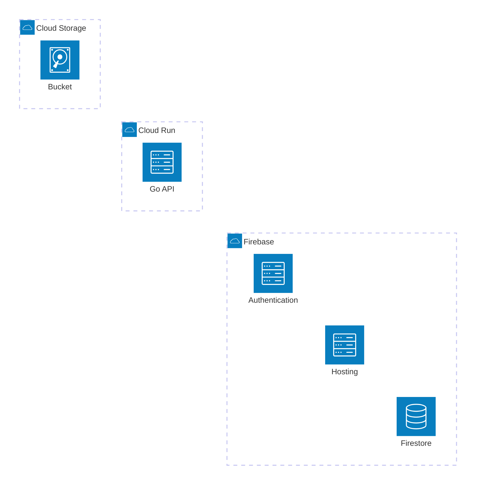
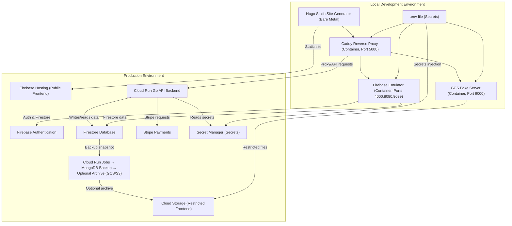
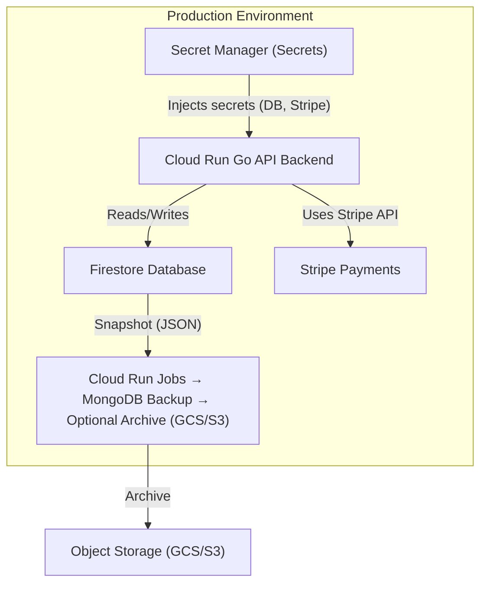
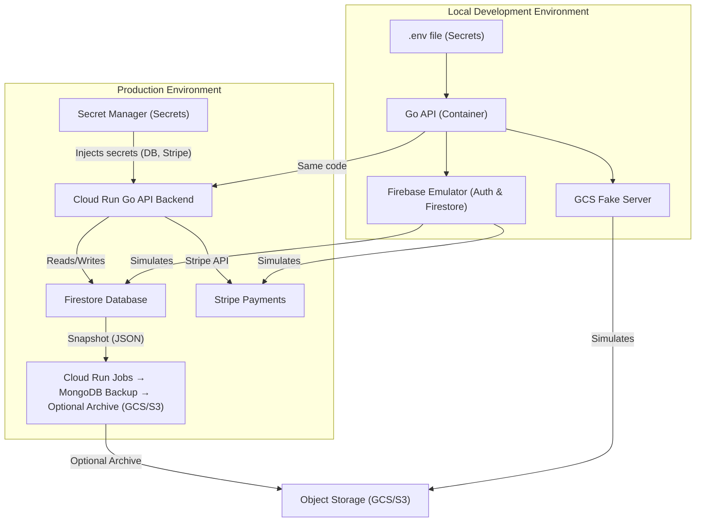

## General



### Services in Production

-   **Firebase Hosting**: Static site frontend (unrestricted pages).
-   **Cloud Storage**: Static site frontend (restricted pages).
-   **Cloud Run**: Go API backend.
-   **Firebase Authentication**: User’s login/logout management, credentials storage.
-   **Firestore**: User’s profile database.
-   **Stripe**: Payment and billing platform.

### Development Infraestructure

In order to simulate the services in production, the development infraestructure uses one local computer with four containers running locally in the computer:

-   **Hugo** static website generator is installed baremetal in the computer.
-   **Caddy** reverse proxy is running in one container (simulates Firebase Hosting)
    -   Port: 5000
-   **Firebase Emulator** is running in another container (simulates Auth and Firestore).
    -   Ports: 4000, 8080 and 9099
-   **GCS Fake Server** is running in another container (simulates GCS Bucket).
    -   Port: 9000
-   **Go API server** is running in another container (simulates Cloud Run).
    -   Port: 8081

> [!IMPORTANT]
> Local development with Firebase Emulator Suite comes with a big limitation: **no support for rewrites** in `firebase.json`. For this reason **Caddy** reverse proxy is used instead of Firebase Hosting in the local development environment.

### Production workflow

-   Changes in development are pushed to GitHub, which triggers GitHub actions.
-   Github action runs Hugo static site generator and deploys public directory to **Firebase**.
-   Github actions runs Cloud Build, pushes image to Artifact Registry and deploys to **Cloud Run**.

## Development Infraestructure Files

### Containers

##### `compose.dev.yaml`

```yaml
version: "3.9"

services:
  # ----------------------------------------------------------------
  # 1. Firebase Emulator Service
  # ----------------------------------------------------------------
  firebase:
    build:
      context: ./firebase
      dockerfile: Containerfile
    container_name: firebase
    image: localhost/firebase-emulator:latest
    ports:
      - "4000:4000"  # Emulator UI
      - "8080:8080"  # Firestore
      - "9099:9099"  # Auth
    volumes:
      - ./.firebase_data:/root/.cache/firebase/emulators
      - ${PWD}/firebase/firebase.json:/app/firebase.json:ro
      - ${PWD}/firebase/firestore.rules:/app/firestore.rules:ro
      - ${PWD}/firebase/firestore.indexes.json:/app/firestore.indexes.json:ro
      - ${PWD}/frontend/public:/app/public:ro
    command: >
      emulators:start
      --project=my-test-project
      --only=auth,firestore
      --import=./firebase_data
      --export-on-exit
    networks:
      - custom_app_network

  # ----------------------------------------------------------------
  # 2. Go Backend Service
  # ----------------------------------------------------------------
  backend:
    build:
      context: ./backend
      dockerfile: Containerfile
    container_name: go-backend
    image: localhost/go-api:latest
    ports:
      - "8081:8081"
    environment:
      - PORT=8081
      - STATIC_ROOT=/public
      - CONTENT_ROOT=/app/posts
      - FIRESTORE_EMULATOR_HOST=firebase:8080
      - FIREBASE_AUTH_EMULATOR_HOST=firebase:9099
      - PROJECT_ID=my-test-project
      - GCLOUD_PROJECT=my-test-project
      - GOOGLE_CLOUD_PROJECT=my-test-project
    volumes:
      - ${PWD}/frontend/public:/public:ro
      - ${PWD}/frontend/content/posts:/app/posts:ro
    depends_on:
      - firebase
    networks:
      - custom_app_network
    network_aliases:
      - go-api-service
    command: ["/app/go-server", "--http=0.0.0.0:8081"]

  # ----------------------------------------------------------------
  # 3. Caddy Reverse Proxy Service
  # ----------------------------------------------------------------
  caddy:
    build:
      context: ./reverse-proxy
      dockerfile: Containerfile
    container_name: caddy-server
    image: localhost/caddy-proxy:latest
    ports:
      - "5000:5000"
    volumes:
      - ${PWD}/reverse-proxy/Caddyfile:/etc/caddy/Caddyfile:ro
      - ${PWD}/frontend/public:/srv:ro
    depends_on:
      - backend
      - firebase
    networks:
      - custom_app_network

# ------------------------------------------------------------------
# 4. Network Definition
# ------------------------------------------------------------------
networks:
  custom_app_network:
    driver: bridge
```

##### `firebase/Containerfile`

```yaml
# Use an official, clean base image with Node.js and Alpine
FROM node:20-alpine

# Install Java Runtime Environment (JRE) required for Firebase Emulators
RUN apk add --no-cache openjdk17-jre

# Install the Firebase CLI globally
RUN npm install -g firebase-tools@14.26.0

# Set the working directory
WORKDIR /app

# Expose ports (matching your compose file)
EXPOSE 4000 8080 9099

# Copy necessary files from the host into the container.
# These will be overwritten by volumes in compose.dev.yaml,
# but are included here for robustness.
COPY firebase.json firestore.rules firestore.indexes.json ./

# Define the entry point to run the emulators
ENTRYPOINT ["/usr/local/bin/firebase"]
CMD ["emulators:start", "--project=my-test-project", "--only=auth,firestore"]
```

##### `backend/Containerfile`

```yaml
# Use the official Go image for a lean base
FROM golang:1.25-alpine AS builder

# Set necessary environment variables
ENV GO111MODULE=on \
    CGO_ENABLED=0 \
    GOOS=linux \
    GOARCH=amd64

# Set the working directory for building
WORKDIR /app

# Copy go.mod and go.sum to cache dependencies
# These files are expected to be in the 'backend/' directory alongside this Containerfile
COPY go.mod go.sum .

# Download dependencies
RUN go mod download

# Copy the rest of the source code
COPY main.go .

# Build the application with -ldflags="-s -w" to strip debug info and symbols, reducing binary size
RUN go build -ldflags="-s -w" -o /go-server .

# --- Final image (minimal base for production/Cloud Run) ---
FROM alpine:latest

RUN apk add --no-cache ca-certificates

# Set the working directory (matching the deployment environment)
WORKDIR /app

# Cloud Run/Go apps listen on the $PORT environment variable, which defaults to 8081 in the container
EXPOSE 8081

# Copy the compiled binary from the builder stage
COPY --from=builder /go-server .

# Create necessary directories that will be used for volume mounts in dev or bundled in prod
RUN mkdir -p /public /app/posts

# Define the default command to run your app
CMD ["/app/go-server"]
```

##### `reverse-proxy/Containerfile`

```yaml
# Build stage
FROM golang:1.25-alpine AS builder

# Install build tools
RUN apk add --no-cache git make gcc musl-dev

# Install xcaddy
RUN go install github.com/caddyserver/xcaddy/cmd/xcaddy@latest

# Build Caddy with standard modules
RUN xcaddy build v2.10.2 \
    --with github.com/caddyserver/caddy/v2/modules/standard \
    --output /usr/bin/caddy

# Final stage
FROM alpine:latest

# Minimal tools + debugging utilities
RUN apk add --no-cache \
    ca-certificates \
    bash \
    curl \
    iproute2 \
    net-tools \
    procps \
    tcpdump \
    vim \
    bind-tools \
    less \
    jq \
    busybox-extras

# Copy Caddy binary
COPY --from=builder /usr/bin/caddy /usr/bin/caddy

# Default config and working dir
WORKDIR /etc/caddy
VOLUME ["/etc/caddy", "/srv"]

# Expose the port
EXPOSE 5000

# Run Caddy
CMD ["/usr/bin/caddy", "run", "--config", "/etc/caddy/Caddyfile"]
```

### Caddyfile

##### `reverse-proxy/Caddyfile`

```caddy
{
    debug
    admin off
}

:5000 {

    # Global logging for all requests
    log {
        output stdout
        format console
        level DEBUG
    }

    # 1. Define a named matcher for all paths that should go to the Go backend
    @backend {
        path /api/*
        path /posts/*
    }

    # 2. Use the named matcher in a handle block
    handle @backend {
        reverse_proxy backend:8081 {
            transport http {
                read_buffer 64kb
                write_buffer 64kb
                dial_timeout 10s
            }
        }
    }

    # Frontend requests (This remains the default fallback handler)
    handle {
        root * /srv
        try_files {path} {path}/ /index.html
        file_server
    }
}
```

## Dev vs Prod

| Area                        | Firebase Emulator (localhost)                                                                  | Production Firebase + GCP                                           | What breaks / changes in prod                                                |
|-----------------------------|------------------------------------------------------------------------------------------------|---------------------------------------------------------------------|----------------------------------------------------------------------------|
| Authentication              | FIREBASE_AUTH_EMULATOR_HOST="localhost:9099" → unlimited users, no email verification, no rate limits | Real users, email verification, password policies, reCAPTCHA, blocked abusive IPs, rate limits | Email verification required, sign-in can be blocked                        |
| Firestore Data              | Data lives only in RAM or local files → disappears on shutdown/restart                         | Data is permanent, global, eventually consistent, billed per read/write/delete | You pay for every operation, data survives forever                        |
| Firestore Security Rules    | Completely ignored unless you explicitly run firebase emulators:start --only firestore,auth with rules | Enforced on every read/write → will reject requests even if your Go Admin SDK bypasses them for client SDKs | Your frontend will 403 if rules are wrong                                 |
| Firebase Admin SDK          | Works normally (you use option.WithoutAuthentication() or service account)                     | In Cloud Run you must use Application Default Credentials or service account key | No WithoutAuthentication() in prod                                          |
| Stripe Webhooks             | You cannot hit localhost from Stripe → you need ngrok/tunnel or stripe listen --forward-to localhost:8081 | Stripe hits your real Cloud Run URL directly                          | Webhook endpoint must be public + HTTPS                                    |
| Cloud Run URLs              | http://localhost:8081                                                                            | https://your-service-abc123-uc.a.run.app                             | CORS, HTTPS, IAP if private                                                |
| Billing & Quotas            | Unlimited everything for free                                                                   | Hard quotas + costs: reads, writes, storage, Auth users, Hosting bandwidth, etc. | You will hit limits and get billed                                          |
| Latency & Consistency       | Instant (<5 ms)                                                                                 | 50–400 ms depending on region + eventual consistency                | Slower, occasional stale reads                                             |
| Functions Triggers          | functions, firestore, auth triggers work locally                                                 | Real Cloud Functions or Cloud Run triggered by events               | Different URLs, cold starts                                                |
| Hosting + Custom Domains    | Only serves on localhost:5000                                                                   | Real custom domain + SSL + CDN                                      | Real SEO, real performance                                                 |
| Identity Platform Features  | Not emulated (phone auth, SAML, OIDC, blocking functions)                                       | Available in prod (extra cost)                                      | Features missing locally                                                   |
| Service Account Permissions | You can use any service account JSON                                                            | In GCP the Cloud Run service account must have exact roles (Firestore, Auth Admin, etc.) | IAM errors if roles missing                                               |
| Logging & Monitoring        | firebase emulators:start prints to console                                                      | Cloud Logging, Error Reporting, Tracing                             | Different debugging experience                                             |


### Quick checklist: “Will it work the same in production?”

| Feature                               | Works identically? | Notes                                                   |
|---------------------------------------|--------------------|---------------------------------------------------------|
| authClient.VerifyIDToken()            | Yes                | Same code                                               |
| firestoreClient.Get/Set with Admin SDK| Yes                | Same code                                               |
| Registration flow (your Go API)      | Yes                | Same code                                               |
| Stripe Checkout Session creation     | Yes                | Same code                                               |
| Stripe webhooks                       | No                 | Must use real endpoint or CLI forwarding                |
| Firestore Security Rules             | No                 | Ignored locally                                         |
| Email verification / password reset  | No                 | Not emulated                                            |
| Rate limiting / abuse protection     | No                 | No limits locally                                       |
| Costs                                 | No                 | $0 vs real money                                        |

### Bottom line you feel every day

- Local emulator → great for 95 % of development (fast, free, offline)
- Production → you suddenly pay, hit quotas, deal with webhooks, security rules, IAM, and real users

Keep developing 100 % against the emulator, but **always do a final test on a real staging project** before releasing — especially Stripe webhooks, security rules, and IAM are the three things that most commonly break when you go live.

### Files develop vs prod

Here’s the **exact list of Firebase-related files/configs** that behave differently or can bite you when you switch from **emulators** to **real production** — and what you must check/adapt in each one.

| File / Config                      | What it contains                                                           | Emulator vs Production difference                                                 | What you MUST change or double-check before going live                                           |
|------------------------------------|---------------------------------------------------------------------------|-----------------------------------------------------------------------------------|------------------------------------------------------------------------------------------------|
| firebase.json                      | Hosting config, rewrites, emulator ports, functions triggers               | In dev you often have rewrites to localhost or emulator ports                     | Remove or comment out any rewrites that point to localhost or emulator ports                   |
| .firebaserc                        | Mapping of local aliases → real Firebase project IDs (default, staging, prod) | firebase use dev → points to your emulator project; firebase use prod → real project | Make sure firebase use prod (or --project your-prod-id) is active before deploy                |
| firestore.rules                    | Security rules                                                            | Completely ignored by emulator unless you start it with --only firestore; always enforced in prod | Test them locally with firebase emulators:start --only firestore + real client SDK (not Admin SDK) |
| firestore.indexes.json             | Composite indexes                                                         | Works the same, but you forget to deploy them → queries fail in prod              | Always run firebase deploy --only firestore:indexes after adding new ones                      |
| storage.rules                      | Storage security rules (if you use Firebase Storage)                       | Same story as Firestore rules — ignored locally unless emulated                   | Deploy + test with real client SDK                                                           |
| functions/.env or functions/.runtimeconfig | Environment variables for Cloud Functions (if you have any)              | Often contain STRIPE_SECRET_KEY=test_..., IS_EMULATOR=true, etc.                   | Switch to live Stripe keys, remove emulator flags                                             |
| src/firebaseConfig.ts or src/firebase.js (web) | firebase.initializeApp({ apiKey, authDomain, projectId, ... })            | Dev version usually points to localhost or dev project (projectId: "demo-dev")    | Change projectId, authDomain, apiKey to production values                                     |
| Service account JSON (for Go backend) | google-credentials.json or ADC in Cloud Run                               | In dev you often use option.WithCredentialsFile("dev-service-account.json") or WithoutAuthentication() | In production Cloud Run → delete WithoutAuthentication() and rely on ADC (default service account) |
| Go environment variables           | FIREBASE_AUTH_EMULATOR_HOST, FIRESTORE_EMULATOR_HOST                       | Set in dev → must be absent in production                                          | Remove these two env vars completely in prod                                                  |
| stripe webhook secret              | Hard-coded or in .env                                                     | Dev: test webhook secret whsec_test_...; Prod: live secret whsec_...               | Use different secrets per environment                                                        |
| functions/index.js or Cloud Run code | Any process.env.IS_EMULATOR checks                                         | Often used to skip email verification, etc.                                        | Remove or guard those blocks for production                                                  |


### Minimal checklist you run before every production deploy

```bash
# 1. Switch project
firebase use prod        # or --project your-real-project-id

# 2. Remove emulator env vars (Go backend)
unset FIREBASE_AUTH_EMULATOR_HOST
unset FIRESTORE_EMULATOR_HOST

# 3. Deploy everything that can be forgotten
firebase deploy --only hosting,firestore:rules,firestore:indexes,functions

# 4. Verify in browser console
#    firebase.app().name → should show your real project ID, not "demo-dev" or "__emulator__"

# 5. Test one real login + one protected API call
# 6. Test one Stripe test → live mode switch (if you have separate test/live projects)
```

Keep the dev versions of these files in a separate branch or `.env.dev` — never commit production secrets or `WithoutAuthentication()` to main.
Do these steps and your switch from emulator → production will be painless every single time.

* * *

Perfect — thanks for laying out your full architecture. I can give a **production vs local development mapping**, and explain how to handle **secrets, environment variables, and backups** cleanly for your setup.

Let’s break it down step by step.

---

## Secrets & API Keys

How to use secrets and API keys in production vs local development.

### 1. Production Stack

| Component                   | Purpose                                  |
| --------------------------- | ---------------------------------------- |
| **Firebase Hosting**        | Serves public frontend pages             |
| **Cloud Storage**           | Serves private/restricted frontend pages |
| **Cloud Run (Go API)**      | Backend API                              |
| **Firebase Authentication** | User login/logout, credential storage    |
| **Firestore**               | User profile database                    |
| **Stripe**                  | Payment & billing                        |

**Key points for production**:

* Secrets (DB credentials, Stripe API keys, service account JSON) **should never live in `.env`**
* Cloud Run fetches secrets from **Secret Manager**
* Frontend is static → no backend secrets are exposed

---

### 2. Local Development Stack

| Component               | Purpose                                             |
| ----------------------- | --------------------------------------------------- |
| **Hugo static site**    | Generates frontend locally                          |
| **Caddy reverse proxy** | Simulates Firebase Hosting (port 5000)              |
| **Firebase Emulator**   | Simulates Auth & Firestore (ports 4000, 8080, 9099) |
| **GCS Fake Server**     | Simulates GCS bucket (port 9000)                    |

**Key points for local dev**:

* `.env` file is fine here (safe locally)
* Docker Compose can read `.env` to configure containers
* Emulators avoid talking to production

---

### 3. Mapping Local → Production

| Local                    | Production                | Notes                                           |
| ------------------------ | ------------------------- | ----------------------------------------------- |
| `.env` file              | Secret Manager            | Inject secrets at runtime                       |
| Firebase Emulator        | Firebase Auth + Firestore | Same API endpoints, just real data              |
| GCS Fake Server          | Cloud Storage             | Same bucket paths                               |
| Caddy reverse proxy      | Firebase Hosting          | Only serves static files                        |
| Docker container for API | Cloud Run                 | Same code, just different environment variables |

---

### 4. Handling `.env` and secrets

#### **Local**

* Docker Compose reads `.env`
* Your Go API reads env vars:

```go
dbPass := os.Getenv("DB_PASSWORD")
stripeKey := os.Getenv("STRIPE_API_KEY")
```

#### **Production**

* Store secrets in **GCP Secret Manager**
* Cloud Run injects secrets **as environment variables**
* No `.env` file needed in production
* The same Go code works, no changes

Example:

```bash
gcloud run deploy go-api \
  --image gcr.io/my-project/go-api:latest \
  --set-secrets DB_PASSWORD=projects/my-project/secrets/db-password:latest \
  --set-secrets STRIPE_API_KEY=projects/my-project/secrets/stripe-api-key:latest
```

* Inside the container: `os.Getenv("DB_PASSWORD")` works exactly like local dev

---

### 5. Handling Firestore + MongoDB backups

For detailed information about backups, visit [backup](/docs/backup).

* Local dev → Firebase Emulator → **no real data**
* Production → Firestore → periodic **JSON snapshot to MongoDB** (cold backup)
* Schedule snapshots via **Cloud Run Job + Cloud Scheduler**
* Backup small dataset daily (you have ~400 documents)
* No incremental backups needed for your scale

Snapshot structure:

```json
{
  "backup_id": "2026-01-09T00:00:00Z",
  "collections": {
    "users": [...],
    "posts": [...]
  }
}
```

Store in:

* MongoDB (primary backup)
* Optional: cloud object storage (S3, GCS, Backblaze B2)

---

### 6. Stripe secrets

* Local dev: `.env` with **test keys**
* Production: Secret Manager with **live keys**
* Go API reads `STRIPE_API_KEY` via `os.Getenv`

---

### 7. Summary: Best practices for your architecture

1. **Local dev**

   * `.env` file is fine
   * Firebase Emulator + GCS fake server + Caddy simulate production
   * Docker Compose reads `.env`

2. **Production**

   * **Do not use `.env`**
   * Use **Secret Manager**
   * Inject secrets at runtime into Cloud Run
   * Static frontend on Firebase Hosting / private pages via Cloud Storage

3. **Backups**

   * Daily JSON snapshot of Firestore → MongoDB (cold backup)
   * Optional archive to object storage
   * No incremental backup needed (your dataset is tiny)

4. **Code portability**

   * Keep Go code **the same** locally and in production
   * Only change **env variable injection mechanism**


---




