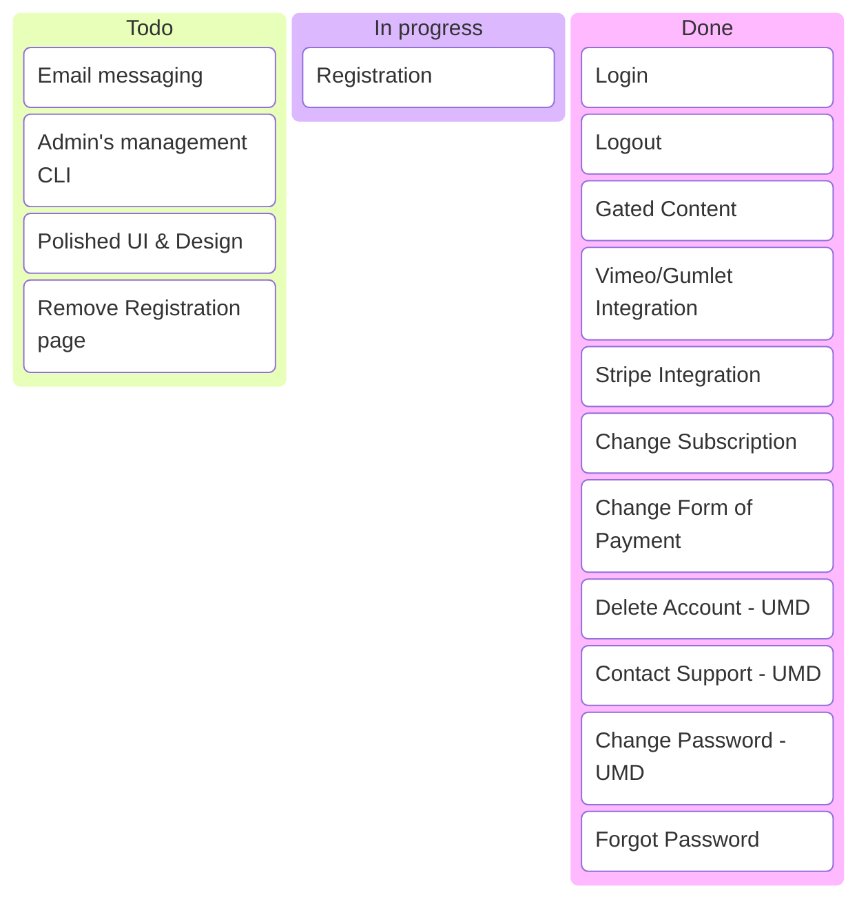

+++
date = '2025-11-28T22:19:23+01:00'
draft = false
title = 'Refactor'
section = 'code'
weight = 750
+++

TODO


#### Work in Progress

- Registration:
    - Require TOS
    - Require Privacy Policy acceptance
- User's Management dashboard (UMD):
    - Contact

#### Doubts

- Delete Stripe customer when users deletes account?
- Better error handling on plan label update in users dashboard?

#### Testing workflow

**Steps to run the development environment without Stripe integration**

1. Run `./up`
2. If you want to add a new post:
	1. `cd frontend`
	2. `hugo new posts/week000x.md`
	3. cd ..
	4. ./addvideo week000x basic <videohslurl>
3. If you want to change the video and plan of a post with real vimeo/gumlet urls:
	1. ./addvideo week000x basic <videohslurl>
4. Create a Firestore user:
	1. `./testing/create_user.sh pepe pro
5. To stop the containers run `./down`

- Note 1: `up` script runs `compose.yaml`, that also runs `upload_posts.sh`
- Note 2: `addvideo` script runs `upload_new_post.sh`


**Steps to run the development environment with Stripe integration**

1. Run `stripe listen --forward-to localhost:5000/api/stripe-webhook`
2. Run `./up`
3. If you want to add a new post:
	1. `cd frontend`
	2. `hugo new posts/week000x.md`
	3. cd ..
	4. ./addvideo week000x basic <videohslurl>
4. If you want to change the video and plan of a post with real vimeo/gumlet urls:
	1. ./addvideo week000x basic <videohslurl>
5. Create a new user:
	1. Navigate to localhost:5000
	2. Register to any of the three plans available
	3. Fill out the Stripe form. Fake Stripe card is 4242 4242 4242 4242
	4. Check the backend logs for the reset link: `docker logs go-backend`
	5. Copy the reset link from the logs and run the following command to reset your password:
		```
		curl "http://127.0.0.1:9099/emulator/action?mode=resetPassword&lang=en&oobCode=RANDOMGENERATEDSTRING&apiKey=fake-api-key&newPassword=MYPASSWORD"
	6. Login in the application with the email and password you just reset: `localhost:5000/login`
		```
3. To stop the containers run `./down`

- Note 1: `up` script runs `compose.yaml`, that also runs `upload_posts.sh`
- Note 2: `addvideo` script runs `upload_new_post.sh`


## - `main.go`

The Firebase Authenticator implementation in code lives on `backend/main.go`

> [!WARNING]
> It's **PARAMOUNT** to import the latest version of `firebase.google.com/go` and `firebase.google/com/go/firebase`.

This is the code needed to run:

```
// ...
import (
    // ...
    "google.golang.org/api/option"
    "cloud.google.com/go/firestore"
    firebase "firebase.google.com/go/v4"
	"firebase.google.com/go/v4/auth"
)

func main() {
	ctx := context.Background()

	authHost := os.Getenv("FIREBASE_AUTH_EMULATOR_HOST")
	if authHost == "" {
		log.Fatal("FIREBASE_AUTH_EMULATOR_HOST environment variable not set.")
	}
	log.Printf("Using Firebase Auth Emulator Host: %s\n", authHost)

	firestoreHost := os.Getenv("FIRESTORE_EMULATOR_HOST")
	if firestoreHost == "" {
		log.Fatal("FIRESTORE_EMULATOR_HOST environment variable not set.")
	}
	log.Printf("Using Firestore Emulator Host: %s\n", firestoreHost)

	conf := &firebase.Config{ProjectID: "my-test-project"}

	app, err := firebase.NewApp(ctx, conf,
		option.WithoutAuthentication(),
		option.WithGRPCConnectionPool(1),
	)
// ...
```

## - `go.mod`

You must have the following go.mod file. Note that `firebase.google.com` version must be 4 or bigger, otherwise 

```
module go-api-backend

go 1.25.4

require (
	cloud.google.com/go/firestore v1.20.0
	firebase.google.com/go/v4 v4.18.0
	google.golang.org/api v0.256.0
)
```

## - `firebase/firestore.rules`

Also, during development, we must allow read/write on the emulator:

```
rules_version = '2';
service cloud.firestore {
  match /databases/{database}/documents {
    match /{document=**} {
      allow read, write: if true;
    }
  }
}
```

## - `firebase/firebase.json`

```
{
  "hosting": {
    "public": "../public",
    "host": "0.0.0.0"
  },
  "firestore": {
    "rules": "firestore.rules",
    "indexes": "firestore.indexes.json",
    "host": "0.0.0.0"
  },
  "emulators": {
    "hosting": { "port": 5000, "host": "0.0.0.0" },
    "firestore": { "port": 8080, "host": "0.0.0.0" },
    "auth": { "port": 9099, "host": "0.0.0.0" },
    "ui": { "enabled": true, "port": 4000, "host": "0.0.0.0" }
  }
}
```

## - `compose.dev.yaml`

```
/...

  # -----------------------------------------------------
  # NEW SERVICE: Go API Backend
  # -----------------------------------------------------
  go-backend:
    image: localhost/test_go-backend:latest
    build:
      context: ./backend
      dockerfile: Containerfile
    container_name: go-api-backend
    ports:
      - "8081:8081" # Expose the API port
    # Ensure it starts after the firebase emulator is up (optional but good practice)
    depends_on:
      - firebase
    environment:
      # Pass the internal network address of the emulator (service name) to the API
      - FIRESTORE_EMULATOR_HOST=firebase:8080
      - FIREBASE_AUTH_EMULATOR_HOST=firebase:9099
    security_opt:
      - label=disable # Required for Fedora/RedHat/SELinux!
```
