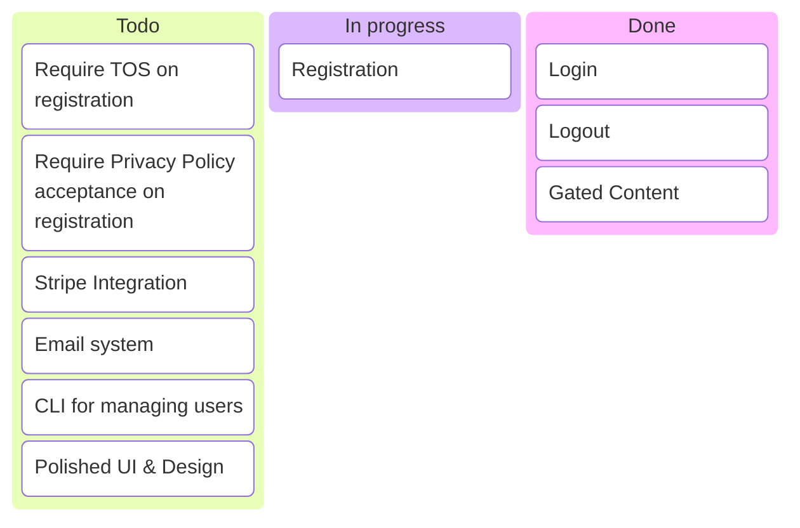

+++
date = '2025-11-28T22:19:23+01:00'
draft = false
title = 'Refactor'
section = 'code'
weight = 750
+++

TODO


## - `main.go`

The Firebase Authenticator implementation in code lives on `backend/main.go`

> [!WARNING]
> It's **PARAMOUNT** to import the latest version of `firebase.google.com/go` and `firebase.google/com/go/firebase`.

This is the code needed to run:

```
// ...
import (
    // ...
    "google.golang.org/api/option"
    "cloud.google.com/go/firestore"
    firebase "firebase.google.com/go/v4"
	"firebase.google.com/go/v4/auth"
)

func main() {
	ctx := context.Background()

	authHost := os.Getenv("FIREBASE_AUTH_EMULATOR_HOST")
	if authHost == "" {
		log.Fatal("FIREBASE_AUTH_EMULATOR_HOST environment variable not set.")
	}
	log.Printf("Using Firebase Auth Emulator Host: %s\n", authHost)

	firestoreHost := os.Getenv("FIRESTORE_EMULATOR_HOST")
	if firestoreHost == "" {
		log.Fatal("FIRESTORE_EMULATOR_HOST environment variable not set.")
	}
	log.Printf("Using Firestore Emulator Host: %s\n", firestoreHost)

	conf := &firebase.Config{ProjectID: "my-test-project"}

	app, err := firebase.NewApp(ctx, conf,
		option.WithoutAuthentication(),
		option.WithGRPCConnectionPool(1),
	)
// ...
```

## - `go.mod`

You must have the following go.mod file. Note that `firebase.google.com` version must be 4 or bigger, otherwise 

```
module go-api-backend

go 1.25.4

require (
	cloud.google.com/go/firestore v1.20.0
	firebase.google.com/go/v4 v4.18.0
	google.golang.org/api v0.256.0
)
```

## - `firebase/firestore.rules`

Also, during development, we must allow read/write on the emulator:

```
rules_version = '2';
service cloud.firestore {
  match /databases/{database}/documents {
    match /{document=**} {
      allow read, write: if true;
    }
  }
}
```

## - `firebase/firebase.json`

```
{
  "hosting": {
    "public": "../public",
    "host": "0.0.0.0"
  },
  "firestore": {
    "rules": "firestore.rules",
    "indexes": "firestore.indexes.json",
    "host": "0.0.0.0"
  },
  "emulators": {
    "hosting": { "port": 5000, "host": "0.0.0.0" },
    "firestore": { "port": 8080, "host": "0.0.0.0" },
    "auth": { "port": 9099, "host": "0.0.0.0" },
    "ui": { "enabled": true, "port": 4000, "host": "0.0.0.0" }
  }
}
```

## - `compose.dev.yaml`

```
/...

  # -----------------------------------------------------
  # NEW SERVICE: Go API Backend
  # -----------------------------------------------------
  go-backend:
    image: localhost/test_go-backend:latest
    build:
      context: ./backend
      dockerfile: Containerfile
    container_name: go-api-backend
    ports:
      - "8081:8081" # Expose the API port
    # Ensure it starts after the firebase emulator is up (optional but good practice)
    depends_on:
      - firebase
    environment:
      # Pass the internal network address of the emulator (service name) to the API
      - FIRESTORE_EMULATOR_HOST=firebase:8080
      - FIREBASE_AUTH_EMULATOR_HOST=firebase:9099
    security_opt:
      - label=disable # Required for Fedora/RedHat/SELinux!
```
