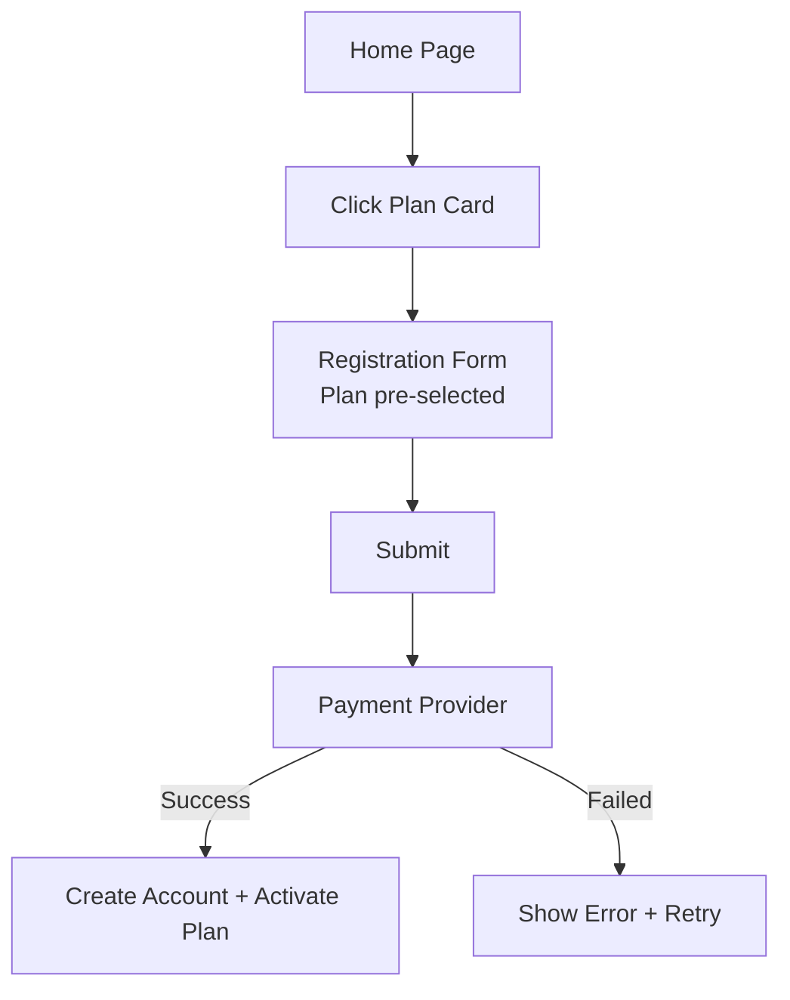
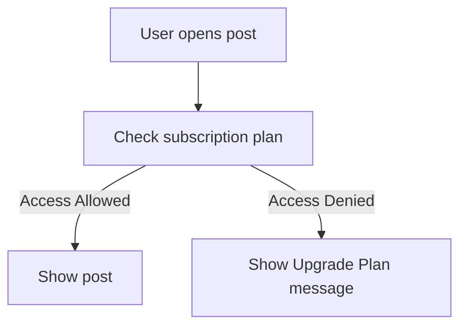
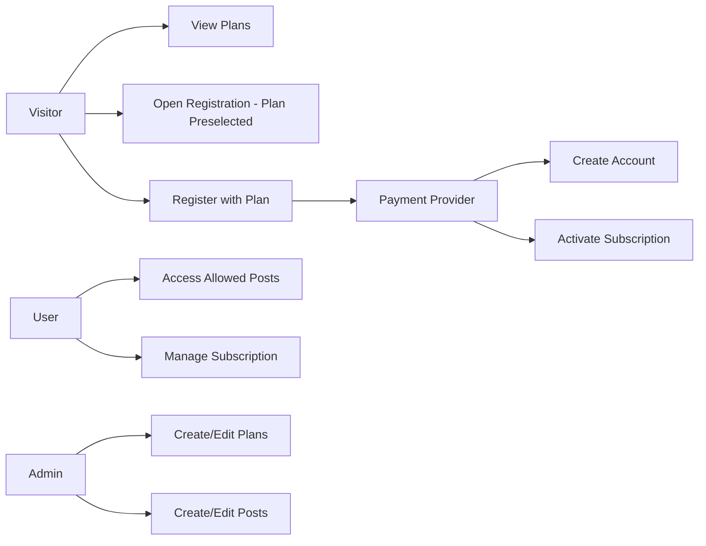

# System Requirements Specification (SRS)

## Membership Subscription Website

* * *

## 1\. Product Overview

A subscription-based membership website where users purchase a subscription plan (Basic, Pro, Elite) to access posts or content according to their plan. No free accounts exist. Users must choose and pay for a plan during registration.

**Key Features:**

-   Paid membership plans with different access levels.
-   Content access controlled by subscription level.
-   Account creation occurs only after successful payment.
-   User dashboard for managing plans, form of payment and account.
-   Admin CLI for managing posts, plans, and users.

* * *

## 2\. Functional Requirements

### User Features

1.  Users can view available membership plans on the home page.
2.  Each plan card shows plan name, price, features, and a “Register” button.
3.  Clicking “Register” opens the registration form with the plan preselected.
4.  Registration form includes:
    -   Name
    -   Email
    -   Password
    -   Plan dropdown (preselected, changeable)
5.  User submits registration form → redirected to payment provider.
6.  Account is created only after successful payment.
7.  Subscription is activated after payment.
8.  Users can log in and access posts according to their plan.
9.  Users can upgrade, downgrade, or cancel their subscription.
10.  Users can change the form of payment.
11.  Users can delete their account (subscription must be cancelled first).

### Admin Features

1.  Create, edit, and delete subscription plans.
2.  Create, edit, and delete posts.
3.  Assign posts to specific plan levels.
4.  View member list and subscriptions.
5.  Manage users (delete user, change email address, password reset, etc).
6.  Manage payments (refunds, etc.).

* * *

## 3\. Non-Functional Requirements

-   Secure authentication and payment processing.
-   Support recurring billing (monthly/yearly).
-   Responsive design for desktop and mobile.
-   Fast page load and content access.
-   Reliable storage of user and subscription data.

* * *

## 4\. Actors

Actor | Description
--- | ---
Visitor | Not logged in, can view plan cards.
User / Member | Logged in, can access posts based on plan.
Admin | Manages plans, posts, and users.
Payment Provider | Handles payment processing (e.g., Stripe).

* * *

## 5\. Use Cases

### Use Case 1 — View Plans & Start Registration

-   **Actor:** Visitor
-   **Goal:** Understand plan options and start registration
-   **Steps:**
    1.  Visitor views membership plans page.
    2.  System displays 3 plan cards: name, price, features, “Register” button.
    3.  Visitor clicks “Register” on a card.
    4.  System opens registration form with the plan preselected.

### Use Case 2 — Register With Plan (Preselected)

-   **Actor:** Visitor
-   **Goal:** Register and pay for a plan
-   **Steps:**
    1.  Visitor enters name, email, password.
    2.  Plan dropdown is preselected (can be changed).
    3.  Visitor submits form.
    4.  System redirects to payment provider.
    5.  Payment succeeds → system creates account and activates subscription.
    6.  Payment fails → show retry/error message.

### Use Case 3 — Access Post

-   **Actor:** User
-   **Goal:** View protected content
-   **Steps:**
    1.  User opens post page.
    2.  System checks plan level.
    3.  IF permitted → show post.
    4.  IF not → show “Upgrade Plan” message.

### Use Case 4 — Manage Subscription

-   **Actor:** User
-   **Goal:** Upgrade, downgrade, or cancel subscription
-   **Steps:**
    1.  User opens dashboard page.
    2.  System shows current plan.
    3.  User selects change or cancel.
    4.  System processes via payment provider.
    5.  Plan updated, access adjusted.

### Use Case 5 — Change Form of Payment

-   **Actor:** User
-   **Goal:** Change form of payment
-   **Steps:**
    1.  User opens dashboard page.
    2.  System shows current form of payment.
    3.  User selects change.
    4.  System processes via payment provider.
    5.  Form of payment updated.

### Use Case 6 — Delete account

-   **Actor:** User
-   **Goal:** Delete account
-   **Steps:**
    1.  User opens dashboard page.
    2.  User selects delete account.
    3.  System checks if subscription is already cancelled.
    4.  System processes via payment provider.
    5.  Account deleted.

### Use Case 7 — Admin Creates Post

-   **Actor:** Admin
-   **Goal:** Publish content for specific plan
-   **Steps:**
    1.  Admin opens “New Post”.
    2.  Writes content and assigns plan.
    3.  Saves post → visible only to allowed members.

### Use Case 8 — Admin Creates Plan

-   **Actor:** Admin
-   **Goal:** Add new subscription plan
-   **Steps:**
    1.  Admin opens “Plans Manager”.
    2.  Enters plan name, price, features.
    3.  Saves → plan becomes available to users.

### Use Case 9 — Admin Manage Users

-   **Actor:** Admin
-   **Goal:** Manage users
-   **Steps:**
    1.  Admin opens “Manage Users”.
    2.  Selects an action (rename, reset password, refund).
    3.  Saves → User status is updated.

* * *

## 6\. User Stories

### User

-   “As a visitor, I want to click a plan card and open the registration form with that plan selected.”
-   “As a visitor, I want to change my plan during registration if I reconsider.”
-   “As a user, I want my account created only after payment is successful.”

### Admin

-   “As an admin, I want to assign posts to specific plans so only eligible users can view them.”
-   “As an admin, I want to create subscription plans for users to purchase.”

* * *

## 7\. Process Flows

### Registration + Payment Flow (Textual)

### Content Access Flow

* * *

## 8\. Use Case Diagram

